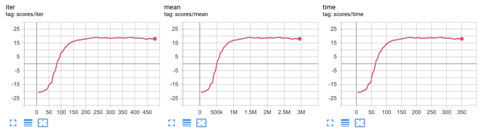
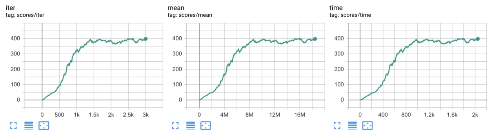

# Mujoco (https://github.com/deepmind/mujoco)  

## How to run:  
* **Humanoid** ```python runner.py --train --file rl_games/configs/mujoco/humanoid.yaml```

## Results:  
* **Pong-v5** 2 minutes training time to achieve 20+ score.
  
* **Breakout-v3** 20 minutes training time to achieve 20+ score.
  


