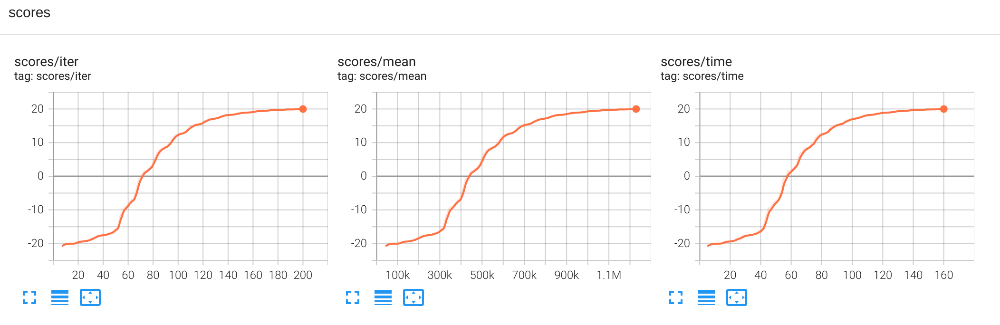
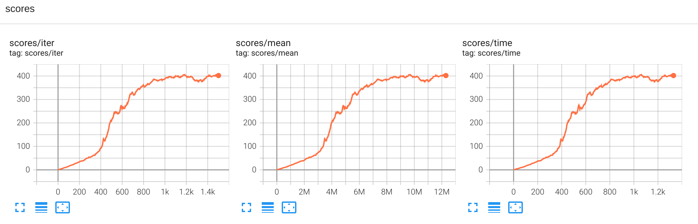

# Atari with Envpool (https://envpool.readthedocs.io/en/latest/)  

## How to run:  
* **Pong** ```python runner.py --train --file rl_games/configs/atari/ppo_pong_envpool.yaml```

## Results:  
* **Pong-v5** 2 minutes training time to achieve 20+ score.
  
* **Breakout-v3** 15 minutes training time to achieve 400+ score.
  


