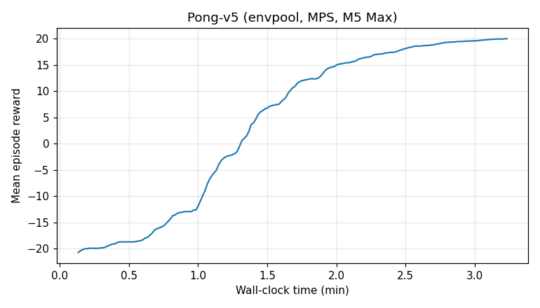
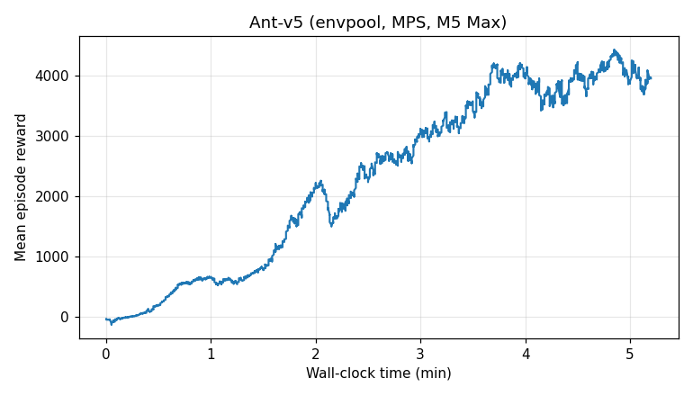
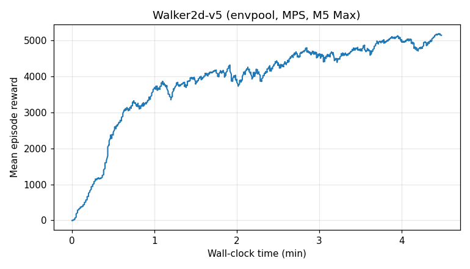
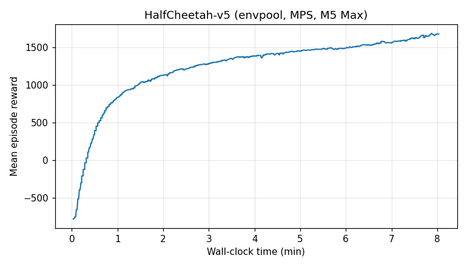

# EnvPool

[EnvPool](https://github.com/sail-sg/envpool) is a high-throughput C++ vectorized environment engine. The `envpool` extra in rl_games provides drop-in support for Atari, MuJoCo, and DeepMind Control families and typically delivers 3–4× faster environment stepping than `gym`/`gymnasium` vector wrappers.

## Install

```bash
pip install -e ".[envpool]"
```

Requires envpool >= 1.2.5 (first release verified against numpy 2.x). On macOS, install envpool from a local Bazel build of [sail-sg/envpool](https://github.com/sail-sg/envpool) — wheels are not published for Apple Silicon yet.

## Quick start

```bash
# Atari
python runner.py --train --file rl_games/configs/atari/ppo_pong_envpool.yaml
python runner.py --train --file rl_games/configs/atari/ppo_breakout_envpool.yaml

# MuJoCo
python runner.py --train --file rl_games/configs/mujoco/ant_envpool.yaml
python runner.py --train --file rl_games/configs/mujoco/halfcheetah_envpool.yaml
python runner.py --train --file rl_games/configs/mujoco/hopper_envpool.yaml
python runner.py --train --file rl_games/configs/mujoco/walker2d_envpool.yaml
python runner.py --train --file rl_games/configs/mujoco/humanoid_envpool.yaml
```

To target Apple Silicon, add `device: mps` and set `mixed_precision: False` in the YAML's `config` block (MPS does not implement the bf16 autocast path used by mixed precision).

## Results — Apple Silicon (M5 Max, MPS)

Single-seed PPO runs on a 16-core M5 Max MacBook (48 GB unified memory) with envpool 1.2.5, torch 2.12 + MPS, on the stock YAML configs from this repo. Charts plot mean episode reward against wall-clock minutes.

| Env | Epochs | Wall-clock | Total FPS | Best reward |
|---|---|---|---|---|
| Pong-v5 | 179 / 250 (stopped at `score_to_win: 20`) | 3.2 min | ~7.5k | 20.0 |
| Hopper-v5 | 1000 / 1000 | 2.2 min | 32.3k | 3,485 |
| Ant-v5 | 2000 / 2000 | 5.3 min | 27.0k | 4,429 |
| Walker2d-v5 | 1000 / 1000 | 4.6 min | 31.4k | 5,186 |
| HalfCheetah-v5 | 1000 / 1000 | 8.1 min | 34.0k | 1,688 |

### Pong-v5


### Hopper-v5


### Ant-v5


### Walker2d-v5


### HalfCheetah-v5


HalfCheetah is undertrained at 1000 epochs on this seed — Hopper/Ant/Walker2d sit at or near their expected PPO bands. For HalfCheetah, raise `max_epochs` or sweep seeds.

## Results — RTX 3090 (legacy, rl_games ≤ 1.6.5)

Historical learning curves from the rl_games 1.6.x docs (originally trained on an RTX 3090).

### Atari PPO

- **Pong-v5**: 20+ score in ~2 min
- **Breakout-v3**: 400+ score in ~15 min


### MuJoCo PPO

Curves trained to convergence in roughly 5–30 min each.


### DeepMind Control PPO

No tuning, 4000 epochs (~32M steps) for most envs (HumanoidRun used fewer). The reward transform `log(reward + 1)` reaches the best scores fastest.

| Env | Reward |
|---|---|
| Ball In Cup Catch | 938 |
| Cartpole Balance | 988 |
| Cheetah Run | 685 |
| Fish Swim | 600 |
| Hopper Stand | 557 |
| Humanoid Stand | 653 |
| Humanoid Walk | 621 |
| Humanoid Run | 200 |
| Pendulum Swingup | 706 |
| Walker Stand | 907 |
| Walker Walk | 917 |
| Walker Run | 702 |

## Notes

- The MPS and 3090 numbers above are not a head-to-head benchmark. The 3090 numbers predate `torch.compile` support and the Triton GAE kernel; the MPS numbers are on today's code. A clean comparison would require re-running this branch on a 3090.
- envpool's MuJoCo throughput is CPU-bound for the small MLP policies in these configs, which is why Apple Silicon stays competitive with discrete-GPU wall-clock despite MPS being slower than CUDA per FLOP.
- For Atari, envpool's native frame-stack and lives tracking are passed through via the `Envpool` wrapper — see `rl_games/envs/envpool.py`.
