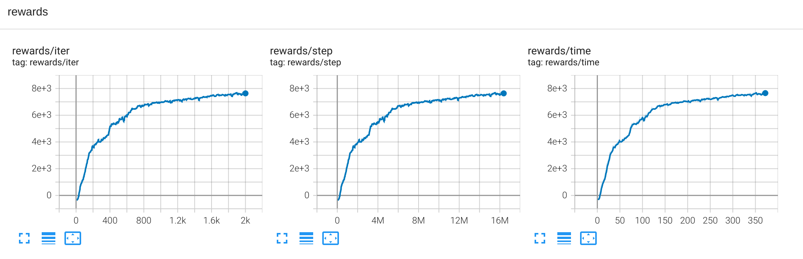
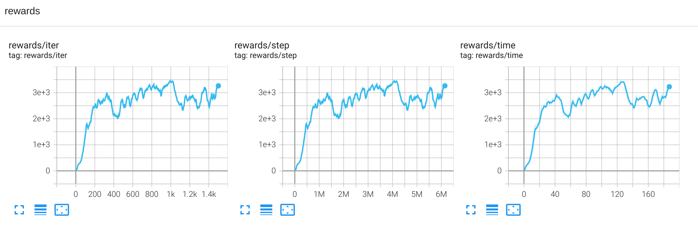
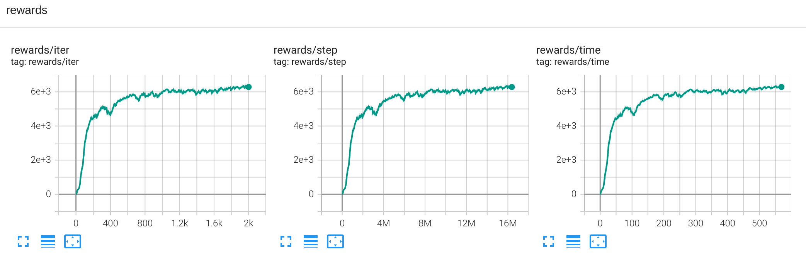
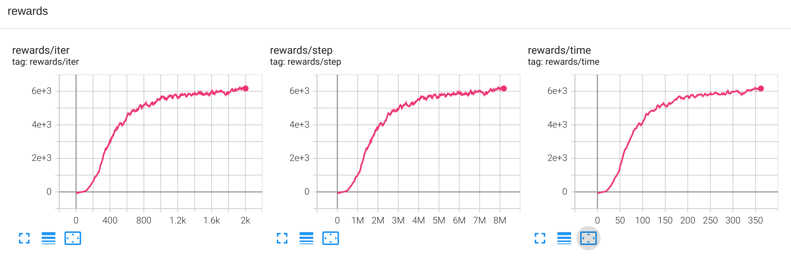
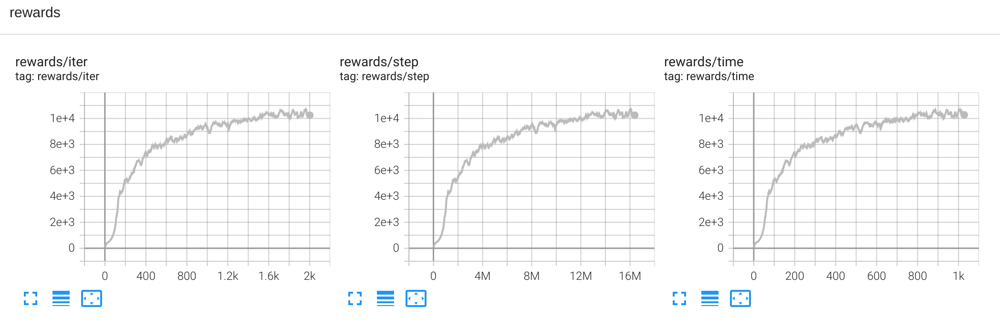
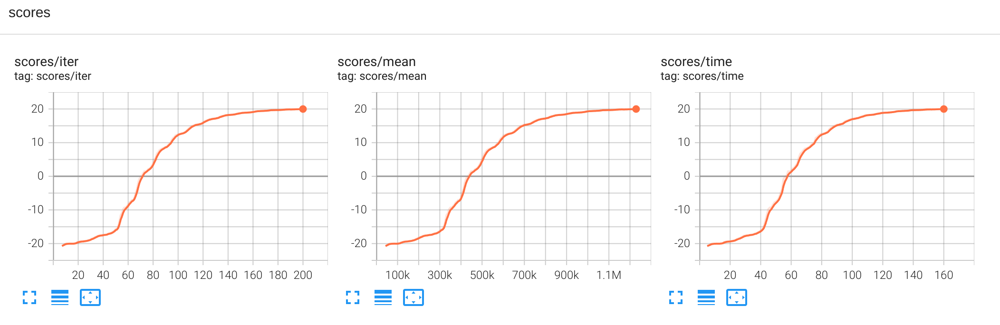
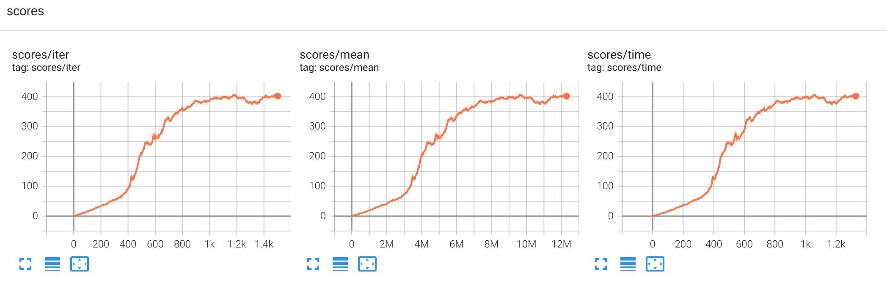

# EnvPool Results (rl_games <= 1.6.5)

This page contains training results from previous versions of rl_games that used [EnvPool](https://github.com/sail-sg/envpool) for high-performance vectorized environments. EnvPool support was removed in rl_games 2.0 in favor of Gymnasium vectorized environments.

**Note:** EnvPool requires NumPy 1.x. NumPy 2.0+ is **not compatible** ([see issue](https://github.com/sail-sg/envpool/issues/312)).

## MuJoCo PPO Results

### HalfCheetah-v4

### Hopper-v4

### Walker2d-v4

### Ant-v4

### Humanoid-v4

## Atari PPO Results

* **Pong-v5** 2 minutes training time to achieve 20+ score.

* **Breakout-v3** 15 minutes training time to achieve 400+ score.

## DeepMind Control PPO Results

No tuning was done. 4000 epochs (~32M steps) for almost all envs except HumanoidRun. A few million steps was enough for most envs. A simple reward transformation `log(reward + 1)` achieves best scores faster.

| Env                | Reward |
| ------------------ | ------ |
| Ball In Cup Catch  | 938    |
| Cartpole Balance   | 988    |
| Cheetah Run        | 685    |
| Fish Swim          | 600    |
| Hopper Stand       | 557    |
| Humanoid Stand     | 653    |
| Humanoid Walk      | 621    |
| Humanoid Run       | 200    |
| Pendulum Swingup   | 706    |
| Walker Stand       | 907    |
| Walker Walk        | 917    |
| Walker Run         | 702    |
