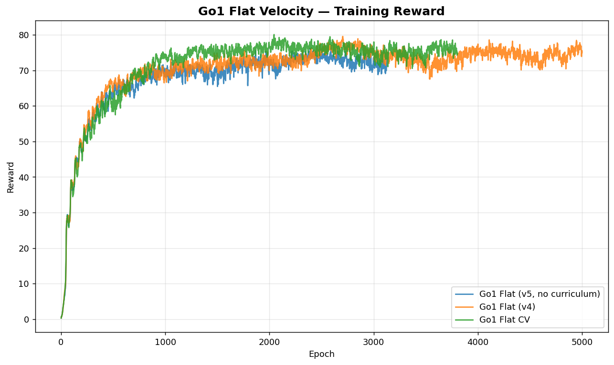
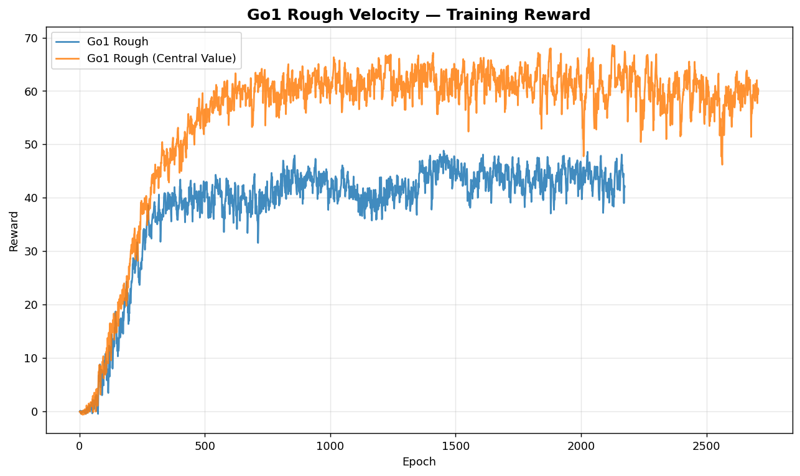
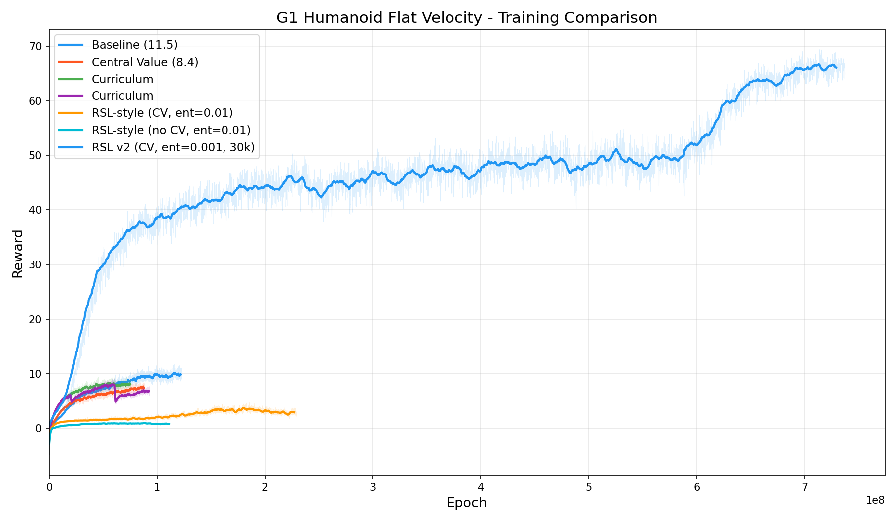

# MJLab (MuJoCo Lab)

[MJLab](https://github.com/NVlabs/mjlab) is a GPU-accelerated robotics simulation framework built on MuJoCo (via Warp). It provides vectorized environments running entirely on GPU with fast parallel physics.

## Setup

```bash
pip install -e ".[mujoco]"
pip install mjlab
```

## How to run

**Go1 Velocity (flat terrain)**
```bash
python run_mjlab.py --config rl_games/configs/mjlab/ppo_go1_velocity.yaml
```

**G1 Humanoid Velocity (flat terrain)**
```bash
python run_mjlab.py --config rl_games/configs/mjlab/ppo_g1_velocity.yaml
```

## Configs

| Environment | Config | Envs | Horizon | Epochs |
|-------------|--------|------|---------|--------|
| Go1 Velocity (flat) | `configs/mjlab/ppo_go1_velocity.yaml` | 1024 | 16 | 3000 |
| G1 Velocity (flat) | `configs/mjlab/ppo_g1_velocity.yaml` | 1024 | 32 | 3000 |

## Results

### Go1 Flat Velocity

1024 parallel envs, ~57k FPS on RTX 5090. Converges to reward ~75 within 1000 epochs.



### Go1 Rough Velocity

Central value network significantly improves rough terrain performance (~60 vs ~45 reward).



### G1 Humanoid Flat Velocity

RSL-style config (v2) with separate actor-critic and entropy 0.001 reaches reward ~65. Baseline config with shared network reaches ~11.


