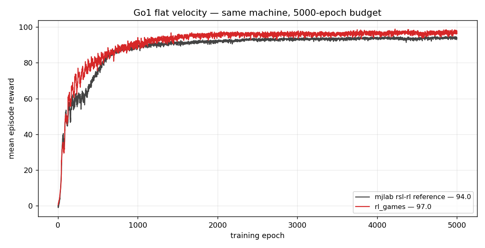
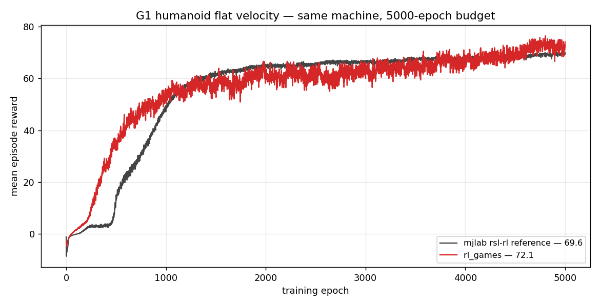
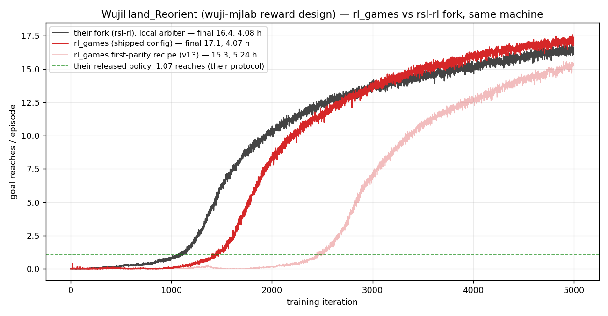

# MJLab (MuJoCo Lab)

[MJLab](https://github.com/NVlabs/mjlab) is a GPU-accelerated robotics simulation framework built on MuJoCo (via Warp). It provides vectorized environments running entirely on GPU with fast parallel physics.

## Setup

```bash
pip install -e ".[mujoco]"
pip install mjlab
```

## How to run

**Go1 Velocity (flat terrain)**
```bash
python runner.py --train --file rl_games/configs/mjlab/ppo_go1_velocity.yaml
```

**G1 Humanoid Velocity (flat terrain)**
```bash
python runner.py --train --file rl_games/configs/mjlab/ppo_g1_velocity.yaml
```

## Configs

| Environment | Config | Envs | Horizon | Epochs |
|-------------|--------|------|---------|--------|
| Go1 Velocity (flat) | `configs/mjlab/ppo_go1_velocity.yaml` | 4096 | 24 | 5000 |
| G1 Velocity (flat) | `configs/mjlab/ppo_g1_velocity.yaml` | 4096 | 24 | 5000 |

**Lift-Cube-Yam (manipulation)**
```bash
python runner.py --train --file rl_games/configs/mjlab/ppo_lift_cube_yam.yaml
```

**WujiHand in-hand cube reorientation** (external task plugin — install
[wuji-mjlab](https://github.com/wuji-technology/wuji-mjlab) from a source clone,
`pip install -e <clone>`; its tasks register via mjlab entry points):
```bash
python runner.py --train --file rl_games/configs/mjlab/ppo_wujihand_reorient.yaml
```
Note for long-horizon manipulation configs: a positive entropy bonus on a global
`fixed_sigma` can drive a sigma runaway over 1B+ frame runs (reproduced in both
fp32 and bf16). The Lift-Cube-Yam config is **validated to task success**: episode success
0.85 over held-out evaluation episodes vs 0.72 for the reference rsl-rl recipe at the
same 491M-frame budget (asymmetric central-value critic on the env's privileged obs
group + value normalization + adaptive LR; see the config for the full recipe).

## Results

### Go1 Flat Velocity

Same-machine comparison against mjlab's own rsl-rl reference recipe, both at
the reference batch geometry (4096 envs × 24 steps) and a 5000-epoch budget
(the command curriculum's stage-1 range; mjlab's 10k default only adds the
harder stage-2 commands after 5000):

| Trainer | Mean episode reward (last-100) |
|---------|-------------------------------|
| mjlab rsl-rl reference | 94.0 |
| rl_games (`ppo_go1_velocity.yaml`) | **97.0** (peak 98.9) |



### Go1 Rough Velocity

Central value network significantly improves rough terrain performance (~60 vs ~45 reward).


### G1 Humanoid Flat Velocity

Same protocol as Go1 (5000-epoch budget, reference geometry):

| Trainer | Mean episode reward (last-100) |
|---------|-------------------------------|
| mjlab rsl-rl reference | 69.6 |
| rl_games (`ppo_g1_velocity.yaml`) | **72.1** (peak 76.5) |



Recipe (both locomotion configs): asymmetric central value on the privileged
`critic` obs group, same size as the actor net, trained at the full 5 mini-epochs —
halving CV epochs was tested and rejected (Go1 drops from 97.0 to 92.6; the
critic quality carries the advantage estimates throughout, not just early);
`schedule_type: standard` with `kl_threshold: 0.016`, entropy 0, truncation
bootstrap on.

### WujiHand In-Hand Cube Reorientation

In-hand reorientation to uniformly sampled SO(3) goals with switch-on-success,
trained on the unmodified wuji-mjlab task (reward design, DR, and success
protocol exactly as released). Same-machine comparison against the vendored
rsl-rl fork that ships with wuji-mjlab, identical data budget
(8192 envs × 40 steps, 5000 iterations, ~1.6B frames):

| Trainer | Goal reaches / episode (train, last-100 mean) | Held-out eval | Wall-clock |
|---------|-----------------------------------------------|---------------|------------|
| wuji-mjlab rsl-rl fork | 16.4 (peak 16.9) | — | 4.08 h |
| rl_games (`ppo_wujihand_reorient.yaml`) | **17.1** (peak 17.6) | 15.1 reaches/ep | **4.07 h** |

rl_games reaches the reference's final quality (16.4) at 3.34 h — 18% less
wall-clock than the reference needs for its full run. Under the project's own
sim2sim deployment protocol (100 trials, reach-one-goal criterion), the
rl_games policy exported to ONNX scores identically to the officially
released policy: success rate 1.00, drop rate 0.0, 1.07 goal reaches per
trial (the protocol saturates after the first reach).



Recipe notes (all in the config): asymmetric central-value critic on the env's
privileged `critic` obs group (16384 × 4 mini-epochs), value normalization on,
truncation `value_bootstrap` on, minibatch 16384 — small minibatches (≤10240)
make the KL-adaptive scheduler noisy, and very few optimizer steps per
iteration (minibatch 32768 → 40 steps) starve the discovery phase on this
task; adaptive LR on the band `min_lr 1e-4` – `max_lr 2e-4` — the floor keeps
the early phase at the reference's proven rate, the cap prevents a
late-training collapse (the env's escalating out-of-cage penalties produce
rare huge negative return bursts that a high LR converts into an unrecoverable
policy regression); state-dependent sigma with
`sigma_parametrization: softplus` and `min_sigma: 0.2`, matching the
exploration floor the task was designed around.

## Notebooks

- `notebooks/mjlab_training.ipynb` — end-to-end Go1 velocity training at notebook scale
  (2048 envs, 1000 epochs, minutes on a modern GPU), plots the curve, saves a checkpoint.
- `notebooks/mjlab_visualization.ipynb` — loads a checkpoint, renders a rollout video
  inline, and runs a commanded-vs-achieved velocity probe (the notebook-scale walker
  achieves ~0.8 m/s at commanded 1.0; undertrained or under-diversified policies probe ~0).
