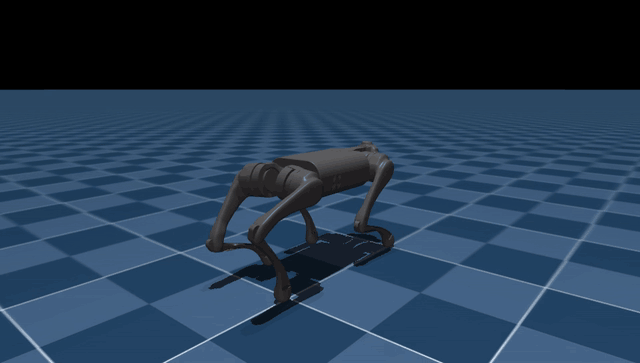
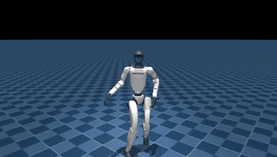
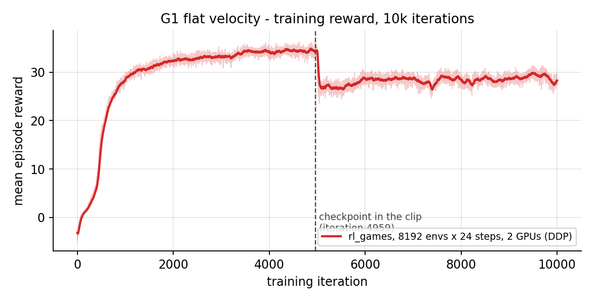
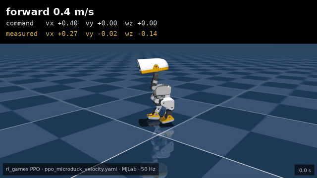
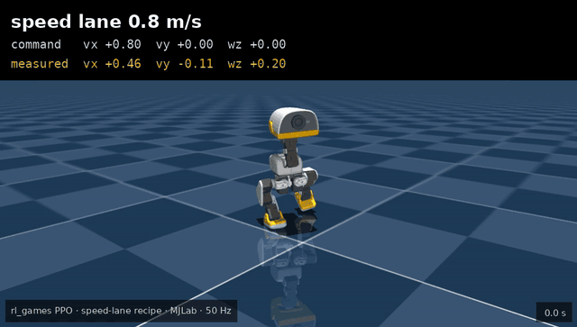

# MJLab (MuJoCo Lab)

[MJLab](https://github.com/NVlabs/mjlab) is a GPU-accelerated robotics simulation framework built on MuJoCo (via Warp). It provides vectorized environments running entirely on GPU with fast parallel physics.

## Setup

```bash
pip install -e ".[mujoco]"
pip install "mjlab>=1.5.3"   # resolves its own warp / mujoco-warp pair; 1.5.0's pair crashed env resets
```

MicroDuck additionally needs the mjlab 1.6 port of its task plugin (see
[MicroDuck](#microduck)).

## How to run

**Go1 Velocity (flat terrain)**
```bash
python runner.py --train --file rl_games/configs/mjlab/ppo_go1_velocity.yaml
```

**G1 Humanoid Velocity (flat terrain)**
```bash
python runner.py --train --file rl_games/configs/mjlab/ppo_g1_velocity.yaml
```

## Configs

| Environment | Config | Envs | Horizon | Epochs |
|-------------|--------|------|---------|--------|
| Go1 Velocity (flat) | `configs/mjlab/ppo_go1_velocity.yaml` | 4096 | 24 | 5000 |
| G1 Velocity (flat) | `configs/mjlab/ppo_g1_velocity.yaml` | 4096 | 24 | 5000 |
| MicroDuck Velocity (flat) | `configs/mjlab/ppo_microduck_velocity.yaml` | 4096 | 24 | 4000 |

**Lift-Cube-Yam (manipulation)**
```bash
python runner.py --train --file rl_games/configs/mjlab/ppo_lift_cube_yam.yaml
```

**WujiHand in-hand cube reorientation** (external task plugin — install
[wuji-mjlab](https://github.com/wuji-technology/wuji-mjlab) from a source clone,
`pip install -e <clone>`; its tasks register via mjlab entry points):
```bash
python runner.py --train --file rl_games/configs/mjlab/ppo_wujihand_reorient.yaml
```
Note for long-horizon manipulation configs: a positive entropy bonus on a global
`fixed_sigma` can drive a sigma runaway over 1B+ frame runs (reproduced in both
fp32 and bf16). The Lift-Cube-Yam config is **validated to task success**: episode success
0.85 over held-out evaluation episodes vs 0.72 for the reference rsl-rl recipe at the
same 491M-frame budget (asymmetric central-value critic on the env's privileged obs
group + value normalization + adaptive LR; see the config for the full recipe).

## Live viewer play

Watch a trained checkpoint drive any mjlab task in real time, using mjlab's
own viewers:

```bash
# Go1
python -m rl_games.envs.mjlab_play \
    --file rl_games/configs/mjlab/ppo_go1_velocity.yaml \
    --checkpoint runs/MJLab_Go1_Velocity/nn/MJLab_Go1_Velocity.pth

# MicroDuck
python -m rl_games.envs.mjlab_play \
    --file rl_games/configs/mjlab/ppo_microduck_velocity.yaml \
    --checkpoint runs/MJLab_MicroDuck_Velocity/nn/MJLab_MicroDuck_Velocity.pth
```

The task's registered play variant is loaded (`load_env_cfg(task,
play=True)`). What that changes is up to the task: mjlab's built-in velocity
tasks make episodes infinite and switch observation corruption off, while
task plugins define their own (MicroDuck's play cfg keeps the 20 s episodes
and noisy actor observations, and shortens the push interval instead).
`--viewer auto` (the default) opens the native MuJoCo window when a display
is present (`DISPLAY`/`WAYLAND_DISPLAY`),
otherwise it starts `ViserPlayViewer` -- a browser UI that works on headless
boxes and prints a local URL (force it with `--viewer viser`). Other flags:
`--task` (override the config's task id), `--num-envs` (default 4),
`--stochastic` (sample actions instead of the deterministic mean), `--device`.

Command control (native viewer, velocity tasks): the `twist` command term is
overridden and re-asserted every step, with the standing/heading/world-frame
rewrites and the resample timer suppressed, and the term's sampling
distribution collapsed onto the commanded values. That last part matters:
episode resets resample commands *inside* `env.step`, after the re-assert,
so pinning the distribution is what keeps a reset from injecting a random
command under the policy for a step. The pinning mutates the live term cfg;
`CommandController.restore_distribution()` puts the original sampling back
(required before handing the same env to mjlab's viser play UI, whose
sliders derive their bounds from `cfg.ranges`).

| Key | Action |
|-----|--------|
| `KP 8` / `KP 2` | forward velocity +/- 0.1 m/s |
| `KP 4` / `KP 6` | yaw rate +/- 0.1 rad/s (left / right) |
| `KP 7` / `KP 9` | lateral velocity +/- 0.1 m/s (left / right) |
| `KP 0` | zero the command |
| `Space`, `Enter` | pause / reset (viewer built-ins) |

The commands sit on the numeric keypad because both layers underneath bind
the letters. mjlab's native viewer reserves `Space` (pause), `Enter`
(reset), `-`/`=` (speed), `,`/`.` (previous / next env), `A` (show all
envs), `P` (plots), `R` (debug visualization) and `→` (single step while
paused), and forwards every key to the command hook *after* its own
binding; the MuJoCo window toggles a visualization or render flag on every
letter (`W` wireframe, `S` shadows, `D` static bodies, ...). The keypad is
free in both layers.

The keyboard override is attached only to the native window (the viser viewer
ships its own play UI). `Enter` resets the env and the policy together
(`PolicyAdapter.reset` zeroes RNN hidden states). Env-internal per-env
resets (a fall; MicroDuck's 20 s truncation) and viser's per-env GUI reset
hand the policy observations only, so an RNN policy carries stale hidden
state across those and recovers over a few steps.

The MJLAB vecenv also accepts `play: true` under `env_config`, which loads
the play cfg through the normal wrapper -- the way to run `runner.py --play`
evaluation on the play variant. `BasePlayer` replaces `env_config` with
`player.env_config` wholesale (no merge), so the block must repeat
`task_name` and `device`:

```yaml
config:
  player:
    env_config:
      task_name: Mjlab-Velocity-Flat-MicroDuck
      device: cuda
      play: true
```

Play runs are unseeded on the env side: the block above replaces the
runner-seeded `env_config`, and `BasePlayer` pops `seed` without forwarding
it (torch / numpy seeding still applies).

## MicroDuck

[MicroDuck](https://github.com/pollen-robotics/microduck_rl) is Pollen
Robotics' palm-sized open-source biped.
`configs/mjlab/ppo_microduck_velocity.yaml` is the default MicroDuck
velocity config: asymmetric actor-critic (actor obs 61, privileged critic
obs 76 on the `critic` obs group), 4096 envs, 50 Hz control. Episodes are
20 s and end in truncation, so `value_bootstrap: true` is essential.

**Port (published 2026-09-22):** upstream `microduck_rl` pins mjlab 1.3; the mjlab-1.6 port lives in
[ViktorM/microduck_rl](https://github.com/ViktorM/microduck_rl), branch `rl-games` (the default),
with upstream's `develop` merged, the ball-walk task, an rl_games ONNX exporter in the robot
runtime's contract and a training / play / export / deploy guide in its README. Install, in a
Python 3.12 venv: `torch==2.13.0` from the cu130 index, `mjlab==1.6.0`, the actuator model
`git+https://github.com/Rhoban/bam.git@57d13ead53206a6bf0db3d66f86506ae8c2ce01a`, the fork
(`pip install -e .`), then rl_games; after that `Mjlab-*-MicroDuck` task names resolve here.

## Results

### Go1 Flat Velocity

Same-machine comparison against mjlab's own rsl-rl reference recipe at the
reference batch geometry (4096 envs × 24 steps), the reference curriculum
schedule, and mjlab's own default budget (10k iterations — the full protocol,
including the doubled stage-2 command ranges the curriculum enables after
iteration 5000):

| Trainer | Mean episode reward (last-100, full 10k protocol) |
|---------|---------------------------------------------------|
| mjlab rsl-rl reference | 83.2 |
| rl_games (`ppo_go1_velocity.yaml`) | **86.8** |



The Go1 clip plays the shipped config's policy at 1.0 m/s, a 0.7 rad/s turn
and 1.5 m/s (measured 0.90, 0.90 with 0.75 rad/s, and 1.10 m/s).

The shipped config stops at `max_epochs: 5000`; the table above was measured
with `max_epochs: 10000` (mjlab's default budget), which is the only override.
At the 5000-iteration mark (stage-1 command range only), the same runs read
94.0 (reference) vs **97.0** (rl_games, peak 98.9):


A compressed-curriculum variant (`velocity_stage_steps` moves the range
expansions to iterations 2500/5000, giving the hardest 2–3 m/s range 5000
training iterations that the default schedule never allocates) produces the
fastest policy: measured 1.07 m/s sustained at a 2.0 m/s command, roughly
double the stage-1 policies.

### Go1 Rough Velocity

Central value network significantly improves rough terrain performance (~60 vs ~45 reward).


### G1 Humanoid Flat Velocity

Humanoid locomotion is a substantially harder task — mjlab's own default
budget for G1 is 30k iterations (3× Go1's), and short-budget reward
comparisons are misleading here: at 5000 iterations both stacks produce
policies that score reward without actually tracking velocity commands
(measure deployable behavior, not reward meters). We do not currently claim
a G1 comparison; the `ppo_g1_velocity.yaml` config is training-stable and
under active tuning against the reference's full-budget result.

The G1 clip in the README comes from an 8192-environment run trained with
DistributedDataParallel on two GPUs (4959 epochs, 1.95B frames) with
`sigma_parametrization: scalar`, played deterministically at commands of
1.0 m/s forward, a 0.5 rad/s turn, and 0.8 m/s forward: measured body-frame
speeds 1.05, 1.03 and 0.91 m/s, no falls. The shipped 4096-environment
config at its 5000-iteration budget still converges to a standing policy
that tracks no command (reward about 75 per episode from the upright and
pose terms alone), which is the trap the paragraph above describes.





Recipe (both locomotion configs): asymmetric central value on the privileged
`critic` obs group, same size as the actor net, trained at the full 5 mini-epochs —
halving CV epochs was tested and rejected (Go1 drops from 97.0 to 92.6; the
critic quality carries the advantage estimates throughout, not just early);
`schedule_type: standard` with `kl_threshold: 0.016`, entropy 0, truncation
bootstrap on.

### WujiHand In-Hand Cube Reorientation

In-hand reorientation to uniformly sampled SO(3) goals with switch-on-success,
trained on the unmodified wuji-mjlab task (reward design, DR and success
protocol exactly as released). Same-machine comparison (one RTX PRO 6000 per
run, same window) against the vendored rsl-rl fork that ships with wuji-mjlab,
identical single-GPU data budget (8192 envs × 40 steps, 5000 iterations,
1.64B frames). The 2-GPU run processes twice as many frames.
Score: goal reaches per episode (training metric, 50-iteration EMA). The raw
action smoothness is reported next to it because a policy can keep scoring
while its actions become unusable (see the stability notes below); the
reference's step-to-step action change is 0.39.

| Trainer | Goal reaches / episode at 5000 | Time to the reference's final score | Action change / step |
|---------|-------------------------------|-------------------------------------|----------------------|
| wuji-mjlab rsl-rl fork (published recipe, actor 512/256/128) | 16.9 | 2.14 h | 0.39 |
| wuji-mjlab rsl-rl fork at rl_games' network widths | 17.35 | 2.22 h | 0.40 |
| rl_games `ppo_wujihand_reorient.yaml` (step-KL adaptive rate), seeds 42 / 7 / 123 | **20.1 / 19.1 / 19.5** | **1.30 / 1.44 / 1.40 h** | 0.37 |
| rl_games, same recipe with a fixed rate of 1e-4 | 19.6 / 18.9 / 18.9 | 1.38 / 1.44 / 1.54 h | 0.37 |
| rl_games, same recipe with the legacy reference-KL scheduler (band 5e-5..2e-4, target 0.01) | 18.8 / 18.2 / 18.9 | 1.56 / 1.86 / 1.60 h | 0.37 |
| rl_games, legacy scheduler, at the reference's network widths | 16.7 | — | 0.36 |
| rl_games `ppo_wujihand_reorient.yaml` on 2 GPUs (2× frames per iteration) | **21.1** | **1.02 h** | 0.36 |
| rl_games, legacy scheduler, on 2 GPUs | 20.6 | 1.27 h | 0.36 |

The three full-width single-GPU rl_games rows each have three seeds
(42 / 7 / 123); the other rows each report one run. These runs had no terminal
action storm. The width comparisons help assess the recipes, but do not
isolate the trainer: exploration, normalization and minibatch geometry also
differ, and the smaller rl_games network used the legacy scheduler. These
are training metrics, not held-out evaluation scores. The shipped recipe
reaches the published reference's final training score in 33–39% less wall
time on this machine; equal frames do not imply equal optimizer steps or
compute cost.


Recipe notes (all in the config): asymmetric central-value critic on the env's
privileged `critic` obs group (16384 × 4 mini-epochs), value normalization on,
truncation `value_bootstrap` on, minibatch 16384, a **global exploration std**
(`fixed_sigma: true`, `sigma_parametrization: softplus`, `min_sigma: 0.2`)
with `entropy_coef: 0`, and a **step-KL adaptive learning rate**
(`kl_schedule_source: optimizer_step`, `schedule_type: standard`,
`kl_threshold: 0.002`, band 5e-5..2e-4, factor 1.5).

The scheduler choice is the result of a controlled comparison on this task
(same seeds, same budget). The legacy scheduler reads a KL measured before the
optimizer step against a stored policy; early in training that number is
mostly drift accumulated over the pass plus observation-normaliser movement,
not the step it is about to take, so it brakes to its floor for the first
~800 iterations and takes off later (18.2–18.9). The shipped scheduler reads
KL(after step || before step) on the same minibatch, averaged over a
mini-epoch, with the target calibrated on the fixed-rate run's step KL
(0.002 before takeoff, 0.003 after). On every seed it ran at ~1.3e-4
before takeoff and 8.9e-5 after (seed 42 stepped down once more, to
7.7e-5, in the last thousand iterations), which matches the recipe's own rate
response (fixed 5e-5 / 1e-4 / 1.5e-4 / 2e-4 on seed 42: 18.5 / 19.9 / 19.2 /
16.8 reaches): headroom above 1e-4 early, none late. Two variants to avoid:
per-minibatch stepping on the step-KL signal ratchets the rate to the floor on
tail events (19.3 on seed 42), and recalibrating the legacy scheduler's
target to 0.02 only reaches parity with the fixed rate (19.4–19.5).
The paired gain over the fixed rate on the three development seeds is
+0.5 / +0.2 / +0.6 reaches (mean +0.4; a 95% interval on three seeds spans
−0.1 to +1.0), and a fourth fixed run on seed 42, with the step-KL
measurement enabled, scored 19.9 and reached the reference's score in
1.23 h, ahead of the scheduler's 1.30 h on that seed. The sign is consistent
and the mechanism is understood; a comparison on fresh seeds is the next step.

**Stability notes.** With a state-dependent std (`fixed_sigma: false`) this
task can collapse thousands of iterations into training: on rare states the
std head extrapolates to values of 40–200 while the batch mean stays at 0.2,
the task's penalty on the raw (unclamped) action explodes, and the policy
does not recover. Batch averages such as entropy and mean KL do not show it,
and an adaptive learning rate cannot act on a tail of states. Two settings
remove it, each verified on three seeds: a global std (the setting Shadow
Hand and DeXtreme trained with; the recipe above) or a ceiling on the
state-dependent std (`max_sigma: 1.0`, 17.6–18.6 reaches with the adaptive
band, 18.8–19.2 with the fixed rate). Do not clip
actions in the trainer while using a state-dependent std here (the task's
penalty then no longer restrains the std head), do not add an entropy bonus
to a global std on long runs, and read every score together with a smoothness
metric. `use_diagnostics: true` logs the batch-max std per mini-epoch
(`diagnostics/policy/sigma_max/<mini_epoch>`), which shows the tail long before a collapse.
Global std and entropy zero changed together, so their individual effects are not isolated. `CONFIG_PARAMS.md` documents `max_sigma`, `kl_reference`, `kl_schedule_source` and the diagnostics.

### MicroDuck Flat Velocity

Same-machine comparison against Pollen's rsl-rl reference recipe at its own
geometry (4096 envs × 24 steps), identical env and reward terms, raw
100-episode mean return on both sides: `ppo_microduck_velocity.yaml` on three
seeds (7, 17, 27; 4000 epochs) vs the reference run (5000 iterations, one
seed). All rl_games rows are on the current code (exact KL, #381).

| | rl_games, shipped recipe (3 seeds) | rl_games, same recipe without value normalization (2 seeds) | rsl-rl reference |
|---|---|---|---|
| final return (last 200 / 500 iterations) | **136.1 / 138.3 / 139.0** (mean 137.8) | 127.6 / 130.1 | 120.3 |
| peak return | **151.4 / 150.7 / 149.1** | 143.1 / 143.6 | 131.7 |
| reaches the rsl-rl final level (120.3) | **iterations 223 to 245, 2.9 to 3.2 min** | iterations 256 to 288 | iteration 1,333, 16.3 min |
| wall-clock for the run | 46 to 50 min for 4,000 iterations (two runs sharing the box) | same | 59.5 min for 5,000 |




The clips (here and in the README) are the seed-17 checkpoint of the
shipped config under one pinned command each, rendered from a camera that
follows the robot, with the commanded and the measured body-frame velocity
(0.5 s average) drawn on the frame. Yaw tracks the command; forward and
backward track at about half of it, as does Pollen's reference policy in the
same simulator; lateral is the weak axis.

**Recipe notes.** The config is Pollen's geometry and reward terms with four
rl_games-side choices, each measured on paired seeds on this task:
`entropy_coef: 0` (a positive bonus on the global log-std runs the std away
under this task's penalty ramp), an explicit adaptive-rate band (`max_lr
1e-3`; the legacy 1e-2 ceiling let the KL-driven raise run away),
`clip_actions: false` (mjlab clamps in the env; pre-clamping distorts both the
actions and the KL the scheduler reads), and `normalize_value: true`, the
change that lifts the final return from 128 / 130 to 136 / 138 / 139: the task ramps
its penalty weights with iteration, so the return scale shifts during
training and an unnormalized value target lags every ramp. Things that did
not help here: a step-KL scheduler (`kl_schedule_source: optimizer_step`,
the WujiHand choice) adds nothing over the legacy one once values are
normalized, because on this task the global std anneals from 0.5 to 0.09 and
either scheduler lowers the rate exactly as fast as the std shrinks; a bigger
central-value critic; and a constant rate, which storms once the std is small
(3e-4 collapses at iteration 1,300, 1.8e-4 at the end of the run).
A floor on the global std (`min_sigma: 0.1`): final 137.2 vs 136.1 without it on seed 7, peak 141.9 vs 151.4; the rate stays higher (8e-5 late instead of 5e-6) but the return does not follow, so the floor is not shipped.

**Speed lane (research preview).** Same robot, same 61-dimensional
observation contract, trained on a variant of the task kept in our fork of
`microduck_rl` ([ViktorM/microduck_rl](https://github.com/ViktorM/microduck_rl), branch `speed-lane`): an ADR-style curriculum that raises
the forward-command cap by 0.1 m/s whenever the rolling median tracking
error at the current cap drops below 0.15 m/s (coupled with the action-rate
penalty ramp), a touchdown-stride gait term, and a bilateral
mirror-consistency loss on the policy, at 16,384 environments for 2,000
iterations (about 45 minutes). The policy reaches **0.40 m/s body-frame
speed** at a 0.8 m/s command with no falls (0.39 m/s at 1.0 m/s, where an
occasional fall appears), against 0.23 m/s for the shipped recipe at its
0.4 m/s command and 0.23 m/s measured for Pollen's reference rsl-rl policy
at the same 0.4 m/s command in the ported simulator.



## Notebooks

- `notebooks/mjlab_training.ipynb` — end-to-end at notebook scale: Go1 velocity training
  (8192 envs, 1000 epochs, ~17 min on an RTX 4090), training curve, then rendering of the
  trained policy and a commanded-vs-achieved velocity probe (the notebook-scale walker
  achieves ~0.9 m/s at commanded 1.0; undertrained or under-diversified policies probe ~0).
  Env count A/B'd back-to-back on an RTX 4090 (minibatch 16384, 1000 epochs): 8192 envs
  reach 95.2 final reward in 17.1 min vs 4096's 88.8 in 11.8 min — same reward-per-frame
  curve, 2× data; throughput scales (200k vs 145k total FPS) and VRAM is no constraint
  (1.7 GiB peak — MJLab is compute-bound, not memory-bound).
- `notebooks/mjlab_training_colab.ipynb` — the same pipeline for Colab: installs rl_games
  from git (until the PyPI release) and mjlab from PyPI, auto-scales env count by GPU VRAM
  (8192 envs on ≥20 GiB runtimes, 4096 below).

**Rendering design — record-then-replay (2026-08-03):** the notebooks never render
from the simulation process. The rollout process (warp/CUDA, zero GL) dumps the
compiled `MjModel` plus per-frame `qpos`; a second process (plain `mujoco` +
EGL, zero warp) replays the states through `mujoco.Renderer` with a tracked
camera. Reason: on some cloud driver stacks (observed: Colab G4, sm_120,
driver 13.0) creating an EGL context in a process where the full mjlab env
holds CUDA segfaults — and with the GL context created first, it deadlocks
instead. Context-creation-order probes alone pass; the fault needs the full
env in-process, so the only robust fix is not sharing the process at all.
Both phases run as subprocesses of the notebook kernel: a native fault
surfaces as an exit code, never a kernel crash. (The step-by-step diagnostic
notebook that isolated this is in git history — removed once the fix was
confirmed on a Colab G4 runtime, 2026-08-03.)

**Versioning (updated 2026-08-02):** do not hand-pin `warp-lang`/`mujoco-warp` —
install `mjlab>=1.5.3` and let it resolve its own pair (warp 1.15.0 +
mujoco-warp 3.10.0.3 as of this writing). History: mjlab 1.5.0 with warp 1.15 /
mujoco-warp 3.10.0.2 crashed env resets (fixed in 3.10.0.3), and pinning back to
warp 1.14 segfaulted the raytracer on Blackwell (sm_120, Colab G4 tier) — warp
1.15's BVH out-of-bounds fix is required there.
