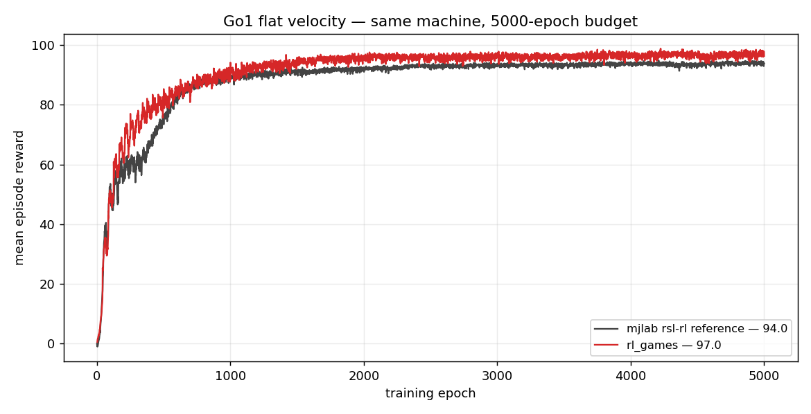
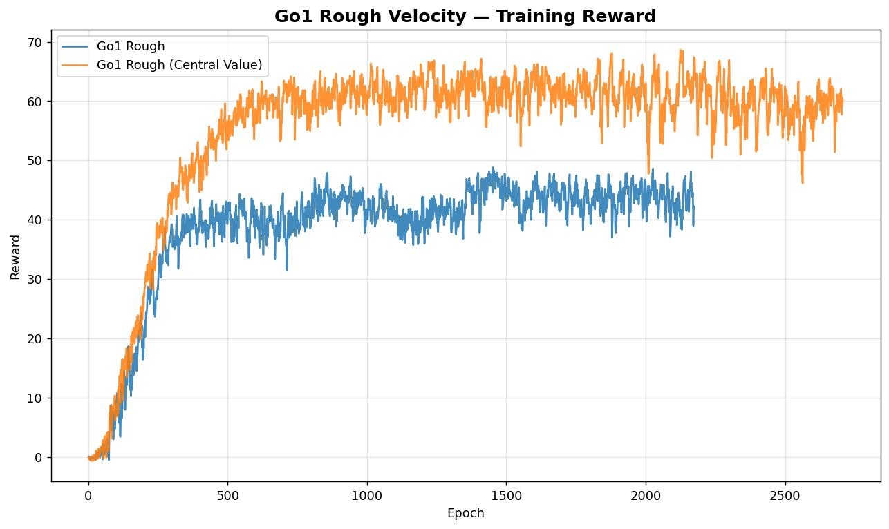
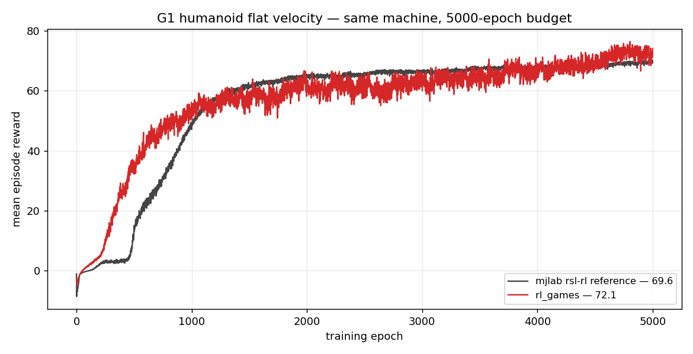
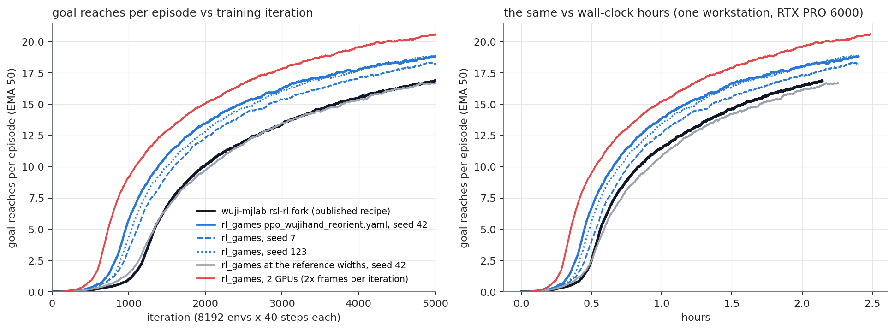
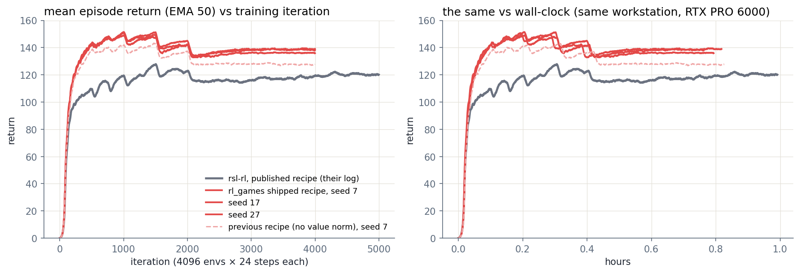
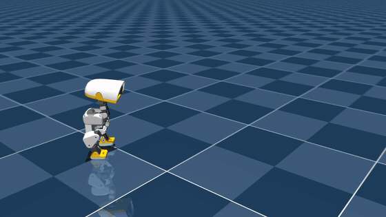

# MJLab (MuJoCo Lab)

[MJLab](https://github.com/NVlabs/mjlab) is a GPU-accelerated robotics simulation framework built on MuJoCo (via Warp). It provides vectorized environments running entirely on GPU with fast parallel physics.

## Setup

```bash
pip install -e ".[mujoco]"
pip install "mjlab>=1.5.3"   # resolves its own warp / mujoco-warp pair; 1.5.0's pair crashed env resets
```

MicroDuck additionally needs the mjlab 1.6 port of its task plugin (see
[MicroDuck](#microduck)).

## How to run

**Go1 Velocity (flat terrain)**
```bash
python runner.py --train --file rl_games/configs/mjlab/ppo_go1_velocity.yaml
```

**G1 Humanoid Velocity (flat terrain)**
```bash
python runner.py --train --file rl_games/configs/mjlab/ppo_g1_velocity.yaml
```

## Configs

| Environment | Config | Envs | Horizon | Epochs |
|-------------|--------|------|---------|--------|
| Go1 Velocity (flat) | `configs/mjlab/ppo_go1_velocity.yaml` | 4096 | 24 | 5000 |
| G1 Velocity (flat) | `configs/mjlab/ppo_g1_velocity.yaml` | 4096 | 24 | 5000 |
| MicroDuck Velocity (flat) | `configs/mjlab/ppo_microduck_velocity.yaml` | 4096 | 24 | 4000 |

**Lift-Cube-Yam (manipulation)**
```bash
python runner.py --train --file rl_games/configs/mjlab/ppo_lift_cube_yam.yaml
```

**WujiHand in-hand cube reorientation** (external task plugin — install
[wuji-mjlab](https://github.com/wuji-technology/wuji-mjlab) from a source clone,
`pip install -e <clone>`; its tasks register via mjlab entry points):
```bash
python runner.py --train --file rl_games/configs/mjlab/ppo_wujihand_reorient.yaml
```
Note for long-horizon manipulation configs: a positive entropy bonus on a global
`fixed_sigma` can drive a sigma runaway over 1B+ frame runs (reproduced in both
fp32 and bf16). The Lift-Cube-Yam config is **validated to task success**: episode success
0.85 over held-out evaluation episodes vs 0.72 for the reference rsl-rl recipe at the
same 491M-frame budget (asymmetric central-value critic on the env's privileged obs
group + value normalization + adaptive LR; see the config for the full recipe).

## Live viewer play

Watch a trained checkpoint drive any mjlab task in real time, using mjlab's
own viewers:

```bash
# Go1
python -m rl_games.envs.mjlab_play \
    --file rl_games/configs/mjlab/ppo_go1_velocity.yaml \
    --checkpoint runs/MJLab_Go1_Velocity/nn/MJLab_Go1_Velocity.pth

# MicroDuck
python -m rl_games.envs.mjlab_play \
    --file rl_games/configs/mjlab/ppo_microduck_velocity.yaml \
    --checkpoint runs/MJLab_MicroDuck_Velocity/nn/MJLab_MicroDuck_Velocity.pth
```

The task's registered play variant is loaded (`load_env_cfg(task,
play=True)`). What that changes is up to the task: mjlab's built-in velocity
tasks make episodes infinite and switch observation corruption off, while
task plugins define their own (MicroDuck's play cfg keeps the 20 s episodes
and noisy actor observations, and shortens the push interval instead).
`--viewer auto` (the default) opens the native MuJoCo window when a display
is present (`DISPLAY`/`WAYLAND_DISPLAY`),
otherwise it starts `ViserPlayViewer` -- a browser UI that works on headless
boxes and prints a local URL (force it with `--viewer viser`). Other flags:
`--task` (override the config's task id), `--num-envs` (default 4),
`--stochastic` (sample actions instead of the deterministic mean), `--device`.

Command control (native viewer, velocity tasks): the `twist` command term is
overridden and re-asserted every step, with the standing/heading/world-frame
rewrites and the resample timer suppressed, and the term's sampling
distribution collapsed onto the commanded values. That last part matters:
episode resets resample commands *inside* `env.step`, after the re-assert,
so pinning the distribution is what keeps a reset from injecting a random
command under the policy for a step. The pinning mutates the live term cfg;
`CommandController.restore_distribution()` puts the original sampling back
(required before handing the same env to mjlab's viser play UI, whose
sliders derive their bounds from `cfg.ranges`).

| Key | Action |
|-----|--------|
| `KP 8` / `KP 2` | forward velocity +/- 0.1 m/s |
| `KP 4` / `KP 6` | yaw rate +/- 0.1 rad/s (left / right) |
| `KP 7` / `KP 9` | lateral velocity +/- 0.1 m/s (left / right) |
| `KP 0` | zero the command |
| `Space`, `Enter` | pause / reset (viewer built-ins) |

The commands sit on the numeric keypad because both layers underneath bind
the letters. mjlab's native viewer reserves `Space` (pause), `Enter`
(reset), `-`/`=` (speed), `,`/`.` (previous / next env), `A` (show all
envs), `P` (plots), `R` (debug visualization) and `→` (single step while
paused), and forwards every key to the command hook *after* its own
binding; the MuJoCo window toggles a visualization or render flag on every
letter (`W` wireframe, `S` shadows, `D` static bodies, ...). The keypad is
free in both layers.

The keyboard override is attached only to the native window (the viser viewer
ships its own play UI). `Enter` resets the env and the policy together
(`PolicyAdapter.reset` zeroes RNN hidden states). Env-internal per-env
resets (a fall; MicroDuck's 20 s truncation) and viser's per-env GUI reset
hand the policy observations only, so an RNN policy carries stale hidden
state across those and recovers over a few steps.

The MJLAB vecenv also accepts `play: true` under `env_config`, which loads
the play cfg through the normal wrapper -- the way to run `runner.py --play`
evaluation on the play variant. `BasePlayer` replaces `env_config` with
`player.env_config` wholesale (no merge), so the block must repeat
`task_name` and `device`:

```yaml
config:
  player:
    env_config:
      task_name: Mjlab-Velocity-Flat-MicroDuck
      device: cuda
      play: true
```

Play runs are unseeded on the env side: the block above replaces the
runner-seeded `env_config`, and `BasePlayer` pops `seed` without forwarding
it (torch / numpy seeding still applies).

## MicroDuck

[MicroDuck](https://github.com/pollen-robotics/microduck_rl) is Pollen
Robotics' palm-sized open-source biped.
`configs/mjlab/ppo_microduck_velocity.yaml` is the default MicroDuck
velocity config: asymmetric actor-critic (actor obs 61, privileged critic
obs 76 on the `critic` obs group), 4096 envs, 50 Hz control. Episodes are
20 s and end in truncation, so `value_bootstrap: true` is essential.

**Port status (2026-09-01):** upstream microduck_rl pins mjlab 1.3.0; the
port of its task plugin to mjlab 1.6 that this config was validated on is
local and not yet published, so `Mjlab-Velocity-Flat-MicroDuck` does not
resolve in the registry and the config ships for the recipe. Once the port
is published, install it as an editable task plugin (its tasks register via
mjlab entry points, like wuji-mjlab above).

## Results

### Go1 Flat Velocity

Same-machine comparison against mjlab's own rsl-rl reference recipe, both at
the reference batch geometry (4096 envs × 24 steps) and a 5000-epoch budget
(the command curriculum's stage-1 range; mjlab's 10k default only adds the
harder stage-2 commands after 5000):

| Trainer | Mean episode reward (last-100) |
|---------|-------------------------------|
| mjlab rsl-rl reference | 94.0 |
| rl_games (`ppo_go1_velocity.yaml`) | **97.0** (peak 98.9) |



### Go1 Rough Velocity

Central value network significantly improves rough terrain performance (~60 vs ~45 reward).



### G1 Humanoid Flat Velocity

Same protocol as Go1 (5000-epoch budget, reference geometry):

| Trainer | Mean episode reward (last-100) |
|---------|-------------------------------|
| mjlab rsl-rl reference | 69.6 |
| rl_games (`ppo_g1_velocity.yaml`) | **72.1** (peak 76.5) |



Recipe (both locomotion configs): asymmetric central value on the privileged
`critic` obs group, same size as the actor net, trained at the full 5 mini-epochs —
halving CV epochs was tested and rejected (Go1 drops from 97.0 to 92.6; the
critic quality carries the advantage estimates throughout, not just early);
`schedule_type: standard` with `kl_threshold: 0.016`, entropy 0, truncation
bootstrap on.

### WujiHand In-Hand Cube Reorientation

In-hand reorientation to uniformly sampled SO(3) goals with switch-on-success,
trained on the unmodified wuji-mjlab task (reward design, DR, and success
protocol exactly as released). Same-machine comparison against the vendored
rsl-rl fork that ships with wuji-mjlab, identical data budget
(8192 envs × 40 steps, 5000 iterations, ~1.6B frames):

| Trainer | Goal reaches / episode (train, last-100 mean) | Held-out eval | Wall-clock |
|---------|-----------------------------------------------|---------------|------------|
| wuji-mjlab rsl-rl fork | 16.4 (peak 16.9) | — | 4.08 h |
| rl_games (`ppo_wujihand_reorient.yaml`) | **17.1** (peak 17.6) | 15.1 reaches/ep | **4.07 h** |

rl_games reaches the reference's final quality (16.4) at 3.34 h — 18% less
wall-clock than the reference needs for its full run. Under the project's own
sim2sim deployment protocol (100 trials, reach-one-goal criterion), the
rl_games policy exported to ONNX scores identically to the officially
released policy: success rate 1.00, drop rate 0.0, 1.07 goal reaches per
trial (the protocol saturates after the first reach).



Recipe notes (all in the config): asymmetric central-value critic on the env's
privileged `critic` obs group (16384 × 4 mini-epochs), value normalization on,
truncation `value_bootstrap` on, minibatch 16384 — small minibatches (≤10240)
make the KL-adaptive scheduler noisy, and very few optimizer steps per
iteration (minibatch 32768 → 40 steps) starve the discovery phase on this
task; adaptive LR on the band `min_lr 1e-4` – `max_lr 2e-4` — the floor keeps
the early phase at the reference's proven rate, the cap prevents a
late-training collapse (the env's escalating out-of-cage penalties produce
rare huge negative return bursts that a high LR converts into an unrecoverable
policy regression); state-dependent sigma with
`sigma_parametrization: softplus` and `min_sigma: 0.2`, matching the
exploration floor the task was designed around.

### MicroDuck Flat Velocity

Same-machine comparison against Pollen's rsl-rl reference recipe at its own
geometry (4096 envs × 24 steps), identical env and reward terms, raw
100-episode mean return on both sides: `ppo_microduck_velocity.yaml` on two
seeds (4000 epochs) vs the reference run (5000 iterations, one seed).

| | rl_games (2 seeds) | rsl-rl reference |
|---|---|---|
| final reward (last 200 / 500 iterations) | **131.6 ± 1.0** | 120.3 |
| peak reward | **147.4** | 131.7 |
| reaches the rsl-rl plateau (120.3) | **iteration 289, 3.6 min** | iteration 1,333, 16.3 min |
| seconds per iteration | 0.72 | 0.71 |





The demo is the seed-17 checkpoint replayed with pinned commands (stand,
forward 0.2 and 0.4 m/s, turn in place both ways, sidestep, backward 0.2)
from a fixed camera; achieved body velocity at the 0.4 m/s forward command
is 0.25–0.27 m/s, yaw 0.84–0.90 rad/s at a 1.0 rad/s command, lateral
0.06 m/s at the 0.3 m/s command: forward and yaw track at roughly two
thirds of the command, lateral is the weak axis. Zero falls in the take.

The two rl_games seeds ran concurrently on one workstation (48 min each),
so their wall-clock axis is pessimistic; per-iteration cost is at parity.
The task curriculum ramps penalty weights with iteration on both sides, so
both curves peak early and settle lower as the penalties come in; the
final-window numbers are the steady state. Recipe differences from the
reference: `entropy_coef: 0` (a positive entropy bonus on rl_games' free
per-dimension log-std inflates sigma under the action-rate ramp and the
policy learns to fall), explicit `min_lr`/`max_lr` bounds on the adaptive
schedule, `clip_actions: false`, value normalization off as in the
reference.

## Notebooks

- `notebooks/mjlab_training.ipynb` — end-to-end at notebook scale: Go1 velocity training
  (8192 envs, 1000 epochs, ~17 min on an RTX 4090), training curve, then rendering of the
  trained policy and a commanded-vs-achieved velocity probe (the notebook-scale walker
  achieves ~0.9 m/s at commanded 1.0; undertrained or under-diversified policies probe ~0).
  Env count A/B'd back-to-back on an RTX 4090 (minibatch 16384, 1000 epochs): 8192 envs
  reach 95.2 final reward in 17.1 min vs 4096's 88.8 in 11.8 min — same reward-per-frame
  curve, 2× data; throughput scales (200k vs 145k total FPS) and VRAM is no constraint
  (1.7 GiB peak — MJLab is compute-bound, not memory-bound).
- `notebooks/mjlab_training_colab.ipynb` — the same pipeline for Colab: installs rl_games
  from git (until the PyPI release) and mjlab from PyPI, auto-scales env count by GPU VRAM
  (8192 envs on ≥20 GiB runtimes, 4096 below).

**Rendering design — record-then-replay (2026-08-03):** the notebooks never render
from the simulation process. The rollout process (warp/CUDA, zero GL) dumps the
compiled `MjModel` plus per-frame `qpos`; a second process (plain `mujoco` +
EGL, zero warp) replays the states through `mujoco.Renderer` with a tracked
camera. Reason: on some cloud driver stacks (observed: Colab G4, sm_120,
driver 13.0) creating an EGL context in a process where the full mjlab env
holds CUDA segfaults — and with the GL context created first, it deadlocks
instead. Context-creation-order probes alone pass; the fault needs the full
env in-process, so the only robust fix is not sharing the process at all.
Both phases run as subprocesses of the notebook kernel: a native fault
surfaces as an exit code, never a kernel crash. (The step-by-step diagnostic
notebook that isolated this is in git history — removed once the fix was
confirmed on a Colab G4 runtime, 2026-08-03.)

**Versioning (updated 2026-08-02):** do not hand-pin `warp-lang`/`mujoco-warp` —
install `mjlab>=1.5.3` and let it resolve its own pair (warp 1.15.0 +
mujoco-warp 3.10.0.3 as of this writing). History: mjlab 1.5.0 with warp 1.15 /
mujoco-warp 3.10.0.2 crashed env resets (fixed in 3.10.0.3), and pinning back to
warp 1.14 segfaulted the raytracer on Blackwell (sm_120, Colab G4 tier) — warp
1.15's BVH out-of-bounds fix is required there.
