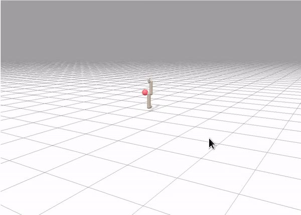

# Brax (https://github.com/google/brax)  

## How to run:  
* **Ant** ```python runner.py --train --file rl_games/configs/brax/ppo_ant.yaml```
* **Humanoid** ```python runner.py --train --file rl_games/configs/brax/ppo_humanoid.yaml```
## Visualization of the trained policy:  
* **brax_visualization.ipynb**

## Results:  
* **Ant** fps step: 1692066.6 fps total: 885603.1  
  
* **Humanoid** fps step: 1244450.3 fps total: 661064.5  
  
* **ur5e** fps step: 1116872.3 fps total: 627117.0  
  


