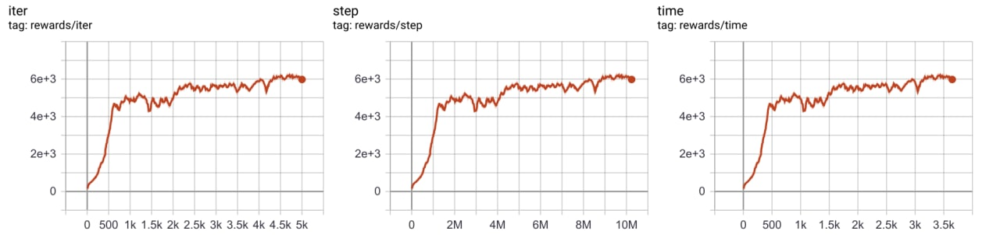
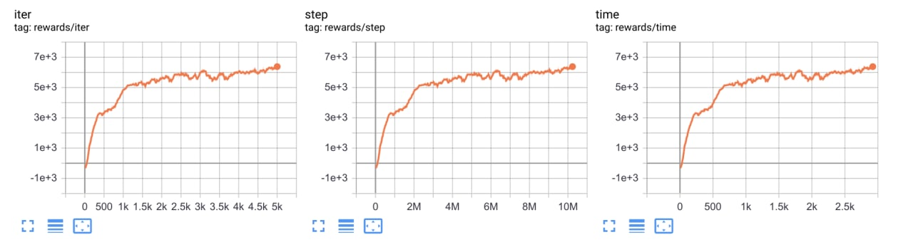
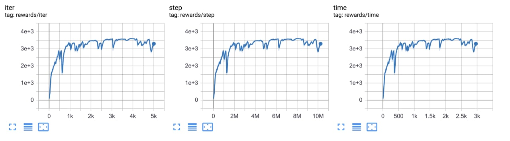
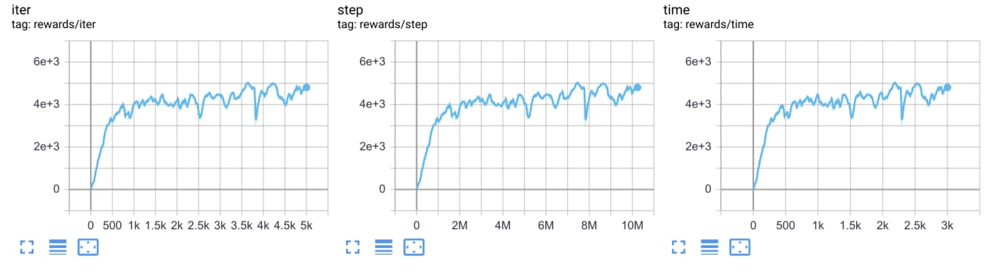

# Mujoco (https://github.com/deepmind/mujoco)  

## How to run:  
* **Humanoid** 

```bash
poetry install -E mujoco
poetry run python runner.py --train --file rl_games/configs/mujoco/humanoid.yaml
```

## Results:  
* **Humanoid-v3**
  
* **HalfCheetah-v3**
  
* **Hopper-v3**  

* **Walker-v3**  
 

