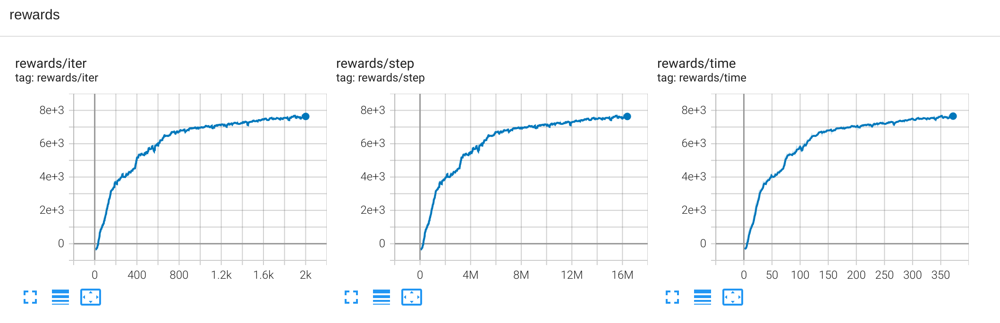
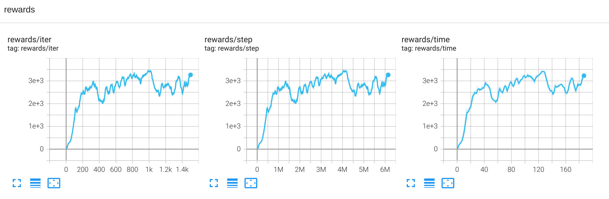
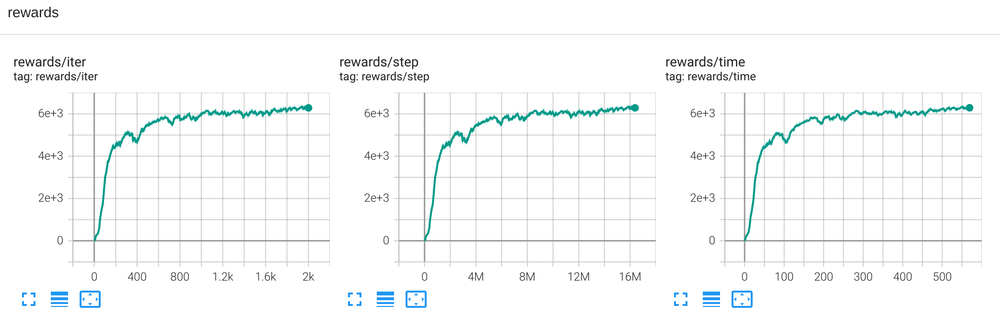
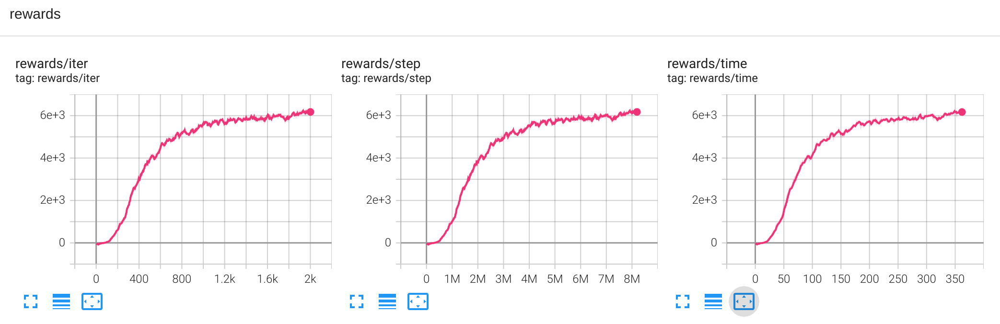
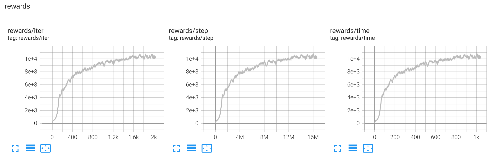

# Mujoco (https://github.com/deepmind/mujoco)  

## How to run:
* **Humanoid** ```python runner.py --train --file rl_games/configs/mujoco/humanoid_envpool.yaml```

## Results:
* **HalfCheetah-v4**

* **Hopper-v4**  

* **Walker2d-v4**  

* **Ant-v4**

* **Humanoid-v4**

