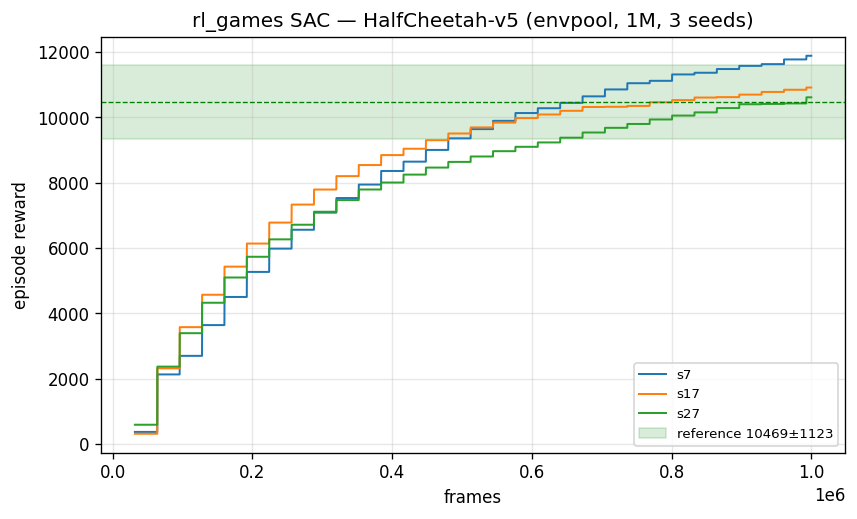
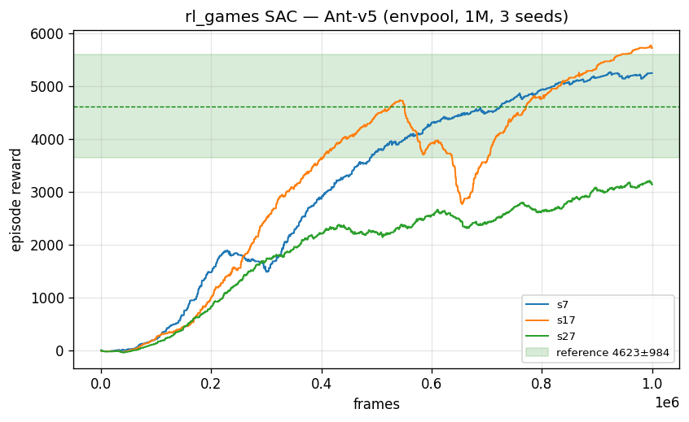
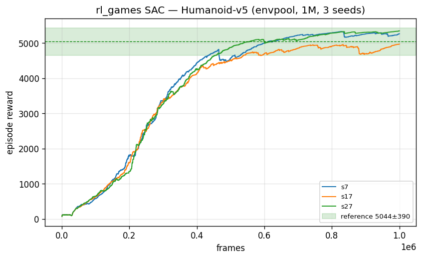
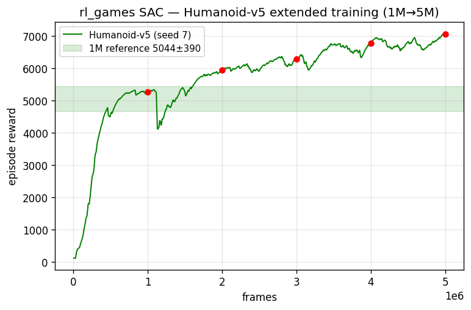
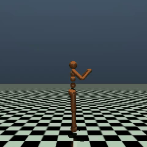

# SAC Benchmarks (MuJoCo)

Soft Actor-Critic results in rl_games on standard MuJoCo continuous-control tasks,
trained with [envpool](ENVPOOL.md) at 32 parallel environments. Numbers are the mean
of the last 10 logged training-reward points (`rewards/step`); each cell is the mean ± std
over **3 seeds** at **1M environment frames**, against published single-environment
SAC reference scores.

Configs: `rl_games/configs/mujoco/sac_*_envpool.yaml` (requires the envpool extra:
`pip install -e ".[mujoco,envpool]"`). Reproduce a single run with

```bash
python runner.py --train --file rl_games/configs/mujoco/sac_ant_envpool.yaml --seed 7
```

Setup: seeds 7 / 17 / 27; envpool 1.2.5, MuJoCo 3.9, Python 3.11. The shipped Ant
and Humanoid configs set `use_contact_force: False` under `env_config`, matching the
observation spaces in the table below (see Notes); the Humanoid benchmark runs were
capped at `max_frames: 1000000` (the shipped config trains to 2M).

## Results (envpool, v5 tasks, 1M frames, 3 seeds)

| Task | rl_games SAC | Reference SAC (1M) | Obs dim |
|------|--------------|--------------------|---------|
| HalfCheetah | **11,140 ± 665** | 10,469 ± 1,123 | 17 |
| Ant | **4,706 ± 1,379** | 4,623 ± 984 | 27 |
| Humanoid | **5,195 ± 198** | 5,044 ± 390 | 348 |

All three match or exceed the published reference means. Reference numbers are
published results from widely used open-source SAC implementations, trained in
the standard single-environment setting for 1M steps.

| HalfCheetah-v5 | Ant-v5 | Humanoid-v5 |
|:---:|:---:|:---:|
|  |  |  |

## Extended training (Humanoid)

Humanoid keeps improving well past 1M frames. A single run (seed 7) trained to
5M frames — each milestone is scored the same way as the table above (mean of the
last 10 logged reward points at that frame count):

| Frames | 1M | 2M | 3M | 4M | 5M |
|--------|----|----|----|----|----|
| Reward | 5,266 | 5,943 | 6,286 | 6,777 | **7,066** |

That is +34% over the 1M score and ~40% above the single-env reference mean, with gains still positive (decelerating) at 5M.



Trained Humanoid-v5 policy (5M frames):



## Notes

- **Environment versions.** Results use the v5 MuJoCo tasks. In envpool, HalfCheetah-v5
  is identical to v4 (no contact-force observations); Ant-v5 and Humanoid-v5 are run with
  `use_contact_force: False` so the tasks use the conventional low-dimensional
  observation spaces (dims in the table above). With contact forces enabled, Ant's
  observation grows from 27 to 105 dims and is harder to learn in a fixed 1M-frame
  budget — set `use_contact_force: True` in the env config to reproduce that variant.
  (envpool's v4 tasks populate the contact-force observations — unlike gymnasium v4,
  where they are zeros — and scored lower in our runs.)
- **Humanoid trains longer.** 1M frames undertrains Humanoid; see the extended-training
  run above, which is still improving at 5M frames.
- **Seed variance.** Ant has the highest seed variance of the three — individual seeds
  occasionally settle into a sub-optimal gait (a known SAC-on-Ant behavior), which widens
  the std; the multi-seed mean stays on the reference.
- **Observation normalization.** `normalize_input: True` is used for HalfCheetah and
  Ant, where an A/B check showed it net-positive (HalfCheetah seed 7: 11,888 with
  normalization vs 11,160 without); the Humanoid config runs without it. Releases
  before 2.0.0 had a bug in SAC's input-normalization statistics update that could
  hurt training — upgrade before enabling it.
