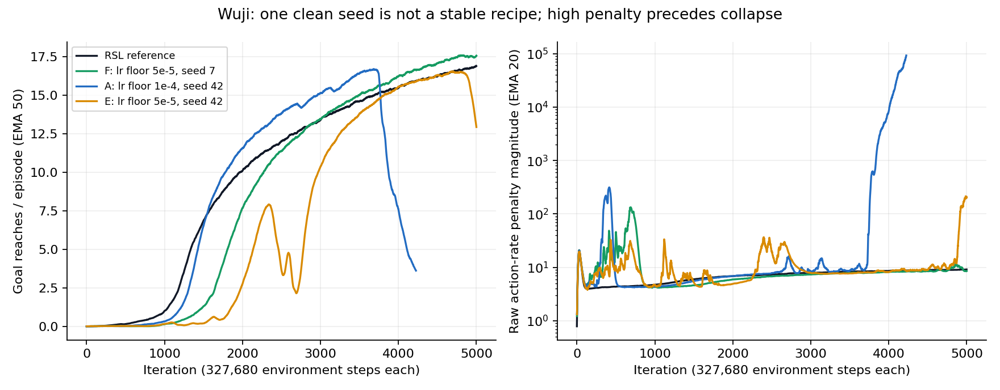

# Wuji Hand stability investigation — 2026-09-16

The best clean recorded rl_games run is **17.56 reaches versus 16.89** for
the reference: about **3.9%**, with comparable smoothness. The same recipe
fails on another seed. A reliable large win has not yet been established.

This investigation read the local action-storm report and independently
parsed its 17 archived TensorBoard runs. The shared Claude URL returned
HTTP 403; the local source is `scratchpad/wuji/build_brainstorm.py` in the
campaign directory recorded in the [evidence](../experiments/wuji/stability/evidence/empirical_findings.md).
The latest `final4_fixedlr` / `final4_novalnorm` runs are not in that archive.

**The first visible failure is an unstable update.** In run B, seed 7:

| Iteration | Logged KL (target .01) | Raw action-delta RMS |
|-----------|-----------------------|----------------------|
| 1038 | .0285 | about .255 |
| 1040 | 3.16 | about .257 |
| 1043 | 39.8 | .459 |
| 1044 | already destabilized | 2.319 |

The learning rate remains at its 1e-4 floor. These are iteration averages,
so this establishes a useful ordering, not a within-update causal trace.
Capture a rollout and optimizer state near 1038, before the visible storm.



**The strongest new suspect: an auxiliary critic can move the policy even
when the PPO loss contributes no gradient.** The Wuji config supplies a
separate privileged central critic, but the actor also has a value head
enabled by the default `use_experimental_cv: true`. The actor and that
head share hidden layers. The head's predictions are discarded during
rollout in favor of the central critic, but its fitting loss still updates
the actor trunk. PPO clipping does not constrain that gradient path.

Using the actual Wuji network recipe and `A2CAgent.calc_losses` on a fixed
synthetic batch, with zero advantages and entropy/bounds terms disabled:

| 80 Adam updates at 1e-4 | Mean absolute action-mean drift | Rollout-relative KL |
|------------------------|---------------------------------|--------------------|
| Auxiliary critic enabled | .2096 | 2.8387 |
| Auxiliary critic disabled | 0 | 0 |

Hard and smooth clipping give identical results in this isolation. It
demonstrates a mechanism, not that this mechanism caused the recorded
storms. Reproduce it in a few seconds:

```bash
.venv/bin/python benchmarks/wuji_aux_critic_probe.py
```

My first task-preserving ablation is **`use_experimental_cv: false`**, with
the privileged central critic still trained. Do this before sigma caps or
changes to the reward. The reference uses separate actor/critic networks.

**Three correctness fixes are implemented in the working tree.**

| Issue reproduced | Change | Limit of the conclusion |
|------------------|--------|-------------------------|
| Identical 20-dimensional Gaussians at sigma .2 report KL −.00230 because of epsilon added to the variance. | Exact diagonal-Gaussian KL, with at least fp32 arithmetic; existing KL direction retained. | Corrects the controller signal; the bias alone cannot explain KL 39.8. |
| Low-precision sigma/log-std calculations bias likelihood ratios. An isolated 20-action bf16 example gave a mean ratio about 1.084 before a parameter update. | Promote low-precision Gaussian parameters before softplus/exp/log and probability reductions. | Does not remove neural-network matmul quantization or changing observation statistics. |
| Old value predictions are transformed before a second running-statistics update transforms returns. They end up in different coordinates. | Accumulate the same two updates, then transform both tensors using the final statistics, for continuous and discrete PPO. | Most relevant when the central critic clips values and return scale shifts. |

In the value-clipping reproduction, the old path incorrectly retained
gradients for 50 of 64 predictions that should already have reached the
clipping plateau. Regression tests cover the actor and central critic
datasets and verify that the accumulated statistics themselves are unchanged.

**Other important differences from the reference.**

1. The campaign uses `use_smooth_clamp: true`; the reference uses ordinary
   PPO clipping. These are not the same objective. For positive advantage
   and ratio 1.21, ordinary clipping gives zero sample surrogate gradient,
   while the smooth variant still has substantial gradient (about .47
   with respect to negative log probability for unit advantage). Test
   `use_smooth_clamp: false` independently of the auxiliary critic switch.
2. rl_games refreshes the KL reference on successive optimization passes,
   while its PPO log-probability reference remains the rollout policy.
   Four equal mean shifts can each report KL .009 while cumulative rollout
   KL reaches .144. The new **`kl_reference: rollout`** option retains the
   original Gaussian. The legacy behavior remains the default. This is
   not a hard KL guard; a restrictive LR floor can still defeat adaptation.
3. The campaign uses larger networks, 20 rather than 32 minibatches,
   normalized and clipped central values, mixed precision, and adaptive
   rather than fixed LR. The reference has raw value MSE without clipping.
   It also clips actor and critic gradients together; rl_games uses
   separate optimizers/norm limits. Matching LR alone does not match the
   effective policy step.
4. Observation statistics are part of the policy. rl_games collects with
   frozen statistics, then updates them during training. `set_train()`
   re-enables updates on each minibatch, despite the end-of-mini-epoch
   `.eval()` call. The reference updates during collection and uses a
   different normalization formula. Freeze weights and compare policies
   before/after a statistics update when replaying the failing batch.

These differences give testable reasons for different robustness margins.
One stable rsl-rl seed does not establish that the reference cannot fail.

**Corrections to the proposed action-storm explanation.** Both trainers
see the raw action-rate penalty and three frames of raw action history,
while physical targets are clamped and filtered. That creates a possible
feedback channel through observations as well as reward. However, negative
returns do not imply all-negative normalized advantages. For a Gaussian,
the log-sigma score is proportional to `A * (z² - 1)`: negative-advantage
near-mean samples widen the distribution, while negative-advantage tail
samples narrow it. With a stationary mean and independent noise, expected
first-plus-second-difference cost is `8 * action_dim * sigma²`; correct
optimization pushes variance down. Widening needs an explanation involving
estimated advantages, policy updates or state feedback, not just negative
reward.

Average entropy only gives geometric-mean sigma. Rare state-dependent
sigma spikes can hide under it. The new opt-in diagnostics record learner
sigma min/mean/max, mean-action magnitude, advantage magnitude, and
rollout-relative log-ratio maxima for every mini-epoch. Enable
`use_diagnostics: true`. They do not yet capture rollout quantiles,
post-step KL, gradient attribution, or live simulator/RNG snapshots.

The task is also not stationary merely because the success curriculum is
maximal: an independent disturbance ramp continues approximately from
iteration 250 to 4000. This could expose fragility near A's onset, but does
not explain E's later failure by itself. See the [environment audit](../experiments/wuji/stability/evidence/environment_audit.md).

**Controlled experiments are ready.**

```bash
# Writes configurations and commands; does not start training.
.venv/bin/python benchmarks/wuji_stability.py --output /tmp/wuji-ablation-configs
```

[Generated configs](../experiments/wuji/stability/configs/manifest.json)
cover seeds 42, 7 and held-out 123. All arms keep raw actions, original
rewards, 8192 environments, 40 rollout steps and 5000 iterations (1.6384B
frames). Compilation is explicitly disabled to avoid defaults changing
between source revisions. Source hashes are recorded. Diagnostics are
enabled on every arm; measure throughput with identical instrumentation.

| Priority | Arm | Purpose |
|----------|-----|---------|
| First | `control`, `no_actor_value`, `hard_clip` | Separate actor-critic interference and surrogate clipping, using corrected arithmetic throughout. |
| Next | `rollout_kl`, `no_cv_clip` | Measure controller reference and critic clipping separately. |
| Use latest results first | `fixed_lr`, `fp32` | Avoid duplicating completed campaign work; prior fp32 screens ended at 2500, before late failures. |
| Calibration | `reference_like` | Reference widths/geometry/raw values/hard clipping/fp32/fixed LR. Normalizer schedule, batch ordering and optimizer coupling still differ; this is not exact algorithm parity. |

The historical A–F runs are not controls for a causal comparison of the
new numerical fixes. For that attribution, use saved-batch replay or
separate patches against the same source revision and seed. Warm-starting
from a policy checkpoint does not reproduce its live environment or
disturbance-curriculum state. Carry promising arms through the full 5000
iterations; seed 42 failed as late as 4909.

For a **large win**, propose a predeclared target of at least 20% higher
held-out reaches at equal training frames, with no material degradation
in drop rate or action smoothness, across the same three seeds for both
trainers. If the reference remains near 16.9, the score target is about
20.3. Compare both final and best checkpoints under the same fixed full
curriculum evaluation. Report failure rate, steps and GPU-hours alongside
wall time. Reward-floor scores and twice-the-data DDP scores do not meet
that criterion.

After stability is established, the wider network is worth revisiting:
it improved takeoff/slope in the screens. Next candidates are separating
actor and critic learning rates/gradient budgets, controlled minibatch
geometry, then normalizer policy-drift treatment. Sigma caps and action
clipping are containment/task-change experiments, not evidence that we
have outperformed the original reference task.

**Validation completed:** 255 tests passed, one expected envpool skip.
A real 64-environment Wuji GPU smoke run completed two updates with bf16,
compiled actor/critic, Triton GAE, fixed rollout KL, auxiliary actor critic
disabled, hard clipping, and the new diagnostics. All 34 logged scalar
series were finite. This verifies integration, not 5000-iteration stability
or a new performance result.

Working-tree base: rl_games `c786561`; clean installed Wuji source
`4e438c0076c7977a52acc36f1426b087a26e8981`; local runtime torch 2.12,
mjlab 1.5.0, mujoco-warp 3.10.0.1, warp 1.14.0. The latest remote campaign
source revision and final4 results still need confirmation. No long
training campaign was launched, and the shipped Wuji recipe was not replaced
with an unvalidated winner.
