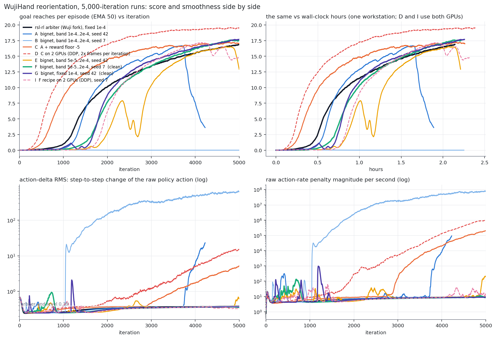
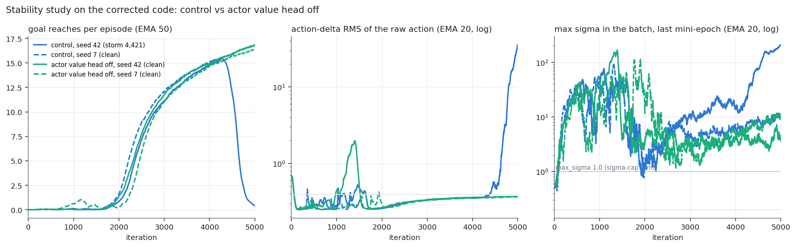

# WujiHand action-rate storm: findings and status (2026-09-17, 10:30 PDT)

Companion to `WUJI_STABILITY.md` (the outside review) and the shareable page
(`https://claude.ai/code/artifact/4413e4cc-fc2b-40db-a112-929ffa3bc65d`, same content, private).
All numbers below are computed from the TensorBoard logs by `scratchpad/wuji/stats_all.py`
and `plot_all.py`; the study runs use branch `VM/fix/wuji-stability` (6e8d1fc).

## Status in one paragraph

Eleven 5,000-iteration runs on the pre-fix code, four on the corrected code. On the
pre-fix code every rl_games run drifts into the action-rate storm at least transiently,
two survive to 5,000 with the reference's smoothness (F: band 5e-5..2e-4, seed 7, 17.6;
G: fixed 1e-4, seed 42, 17.7), the rsl-rl reference never drifts (16.9). On the corrected
code, `control` (band 5e-5..2e-4) is 1 of 2 seeds clean, and **`no_actor_value`
(`use_experimental_cv: false`, the actor's auxiliary value head removed) is 2 of 2 seeds
clean** at 16.8 and 16.4 reaches with action-delta RMS 0.37 (reference 0.39). It is the
first arm clean on both seeds. Running now: the `sigma_cap` pair (`max_sigma: 1.0`), then
`no_actor_value` on the held-out seed 123 beside `no_actor_value + max_sigma` on seed 42,
then `no_actor_value` on 2 GPUs, then `hard_clip`, `rollout_kl`, `no_cv_clip`.

## Results, pre-fix code

| run | recipe | reaches at end (EMA 50) | peak @ iter | takeoff (≥5) | hours | h to 16.9 | end action-delta RMS | end raw action-rate /s | status |
|---|---|---|---|---|---|---|---|---|---|
| July v16 | 512 actor, band 1e-4..2e-4, July code, RTX 4090 | 17.15 | 17.17 @ 4,987 | 1,797 | 4.07 | 3.91 | 0.375 | 11 | reference only |
| Arbiter | Wuji rsl-rl fork, fixed 1e-4 | 16.89 | 16.91 @ 4,998 | 1,336 | 2.14 | 2.14 | 0.388 | 9 | clean |
| A | bignet, band 1e-4..2e-4, seed 42 | 3.61 | 16.69 @ 3,685 | 1,429 | 1.89 | — | 22.791 | 98,870 | terminal storm 3,749; killed 4,264 |
| B | bignet, band 1e-4..2e-4, seed 7 | 0.00 | 0.29 @ 1,046 | never | 2.25 | — | 659.325 | 66,135,912 | terminal storm 1,044 (pre-takeoff) |
| C | A + reward floor −5 | 16.98 | 17.22 @ 4,778 | 758 | 2.26 | 1.84 | 5.075 | 198,695 | storm 2,967 under the floor; disqualified |
| D | C on 2 GPUs (2x frames/iter) | 19.51 | 19.57 @ 4,811 | 538 | 2.39 | 0.96 | 15.992 | 1,142,660 | storm 1,918 under the floor; throughput point only |
| E | bignet, band 5e-5..2e-4, seed 42 | 12.93 | 16.54 @ 4,701 | 2,137 | 2.21 | — | 0.609 | 184 | terminal storm 4,909 |
| F | bignet, band 5e-5..2e-4, seed 7 | 17.56 | 17.57 @ 4,820 | 1,807 | 2.22 | 1.93 | 0.358 | 9 | clean |
| G | bignet, fixed 1e-4, seed 42 | 17.69 | 17.69 @ 5,000 | 1,794 | 2.26 | 1.98 | 0.370 | 9 | clean |
| H | E + value normalisation off | 0.00 | 0.01 @ 100 | never | 2.57 | — | 149980.016 | 1,544,143,765,504 | destroyed by 105 (aux value head, raw MSE) |
| I | F's recipe on 2 GPUs, seed 7 | 14.95 | 17.18 @ 4,147 | 1,946 | 2.32 | 1.84 | 0.341 | 16 | peak 17.2 then faded to 15.0, no storm |

Reference smoothness: action-delta RMS 0.39, raw action-rate 9 per second. "h to 16.9" is
wall-clock until the EMA first reaches the arbiter's final value. D and I process twice the
frames per iteration at 1.7 s per iteration, so 2 GPUs mean data per iteration, not seconds
per iteration (390k vs 205k frames/s).

## Results, corrected code (study)

| arm | seed | reaches at 5,000 | end action-delta RMS | KL>1 events | max sigma at 5,000 (last mini-epoch) | storms (action-delta EMA20 > 0.45) |
|---|---|---|---|---|---|---|
| control | 42 | 0.41 (peak 15.5 @ 4,270) | 35.6 | 0 | 216 | 1,029–1,038, 1,436–1,523, **4,421–5,000** |
| control | 7 | 16.9 | 0.363 | 2 | 11.5 | 352–355 |
| no_actor_value | 42 | 16.8 | 0.366 | 0 | 2.5 | 1,007–1,022, 1,101–1,509 (recovered) |
| no_actor_value | 7 | 16.4 | 0.366 | 1 | 8.8 | 1,612–1,626 (recovered) |

## What the storm is (diagnostics on the corrected code)

The new opt-in diagnostics log, per mini-epoch, the batch maximum of sigma, of |mu| and of the
rollout log-ratio. The batch **mean** sigma sits on the 0.2 floor in every run. The batch
**maximum** does not:

| control seed 42, iteration | mean sigma | max sigma | max abs mean action | max abs log-ratio | action-delta RMS |
|---|---|---|---|---|---|
| 4,300 | 0.210 | 36 | 3.1 | 230 | 0.380 |
| 4,400 | 0.220 | 58 | 4.4 | 20 | 0.405 |
| 4,420 (storm tips) | 0.240 | 69 | 4.8 | 753 | 0.460 |
| 4,500 | 0.237 | 60 | 6.1 | 258 | 0.424 |

The policy std is state-dependent (`softplus(raw) + 0.2`, no ceiling). On a small set of
states it emits sigma of 40–200 and means of 3–7 (the actuator clamps at ±1), and that tail
grows for hundreds of iterations before the storm tips. The clean seed-7 control has the
same tail growing more slowly (max sigma 0.5 at 2,000, 14 at 4,900); `no_actor_value` keeps
it far smaller (2.5 and 8.8 at 5,000). Those states produce out-of-range actions, likelihood
ratios of e^100 and per-sample KL of order 100, and they feed back through the three frames
of raw-action history in the observations and the unbounded action-rate term (weight −1,
first plus second squared differences of the raw action). Batch means hide all of this.

Consequences for the adaptive learning rate:

1. Its signal is the batch-mean KL, which a few tail samples with KL ~100 either dominate or,
   with the previous-mini-epoch reference (`dataset.update_mu_sigma` after each minibatch),
   hide. Neither reading identifies the tail.
2. Its only actuator is one global learning rate inside a 2–4x band. A rate cut slows the whole
   policy equally and does nothing to the tail states, which drift at 5e-5 as at 2e-4.
3. A linear schedule (2e-4 → 5e-5) has the same blind spot with no feedback; it would sit at
   its highest rate during the pre-takeoff explosive updates and at its lowest late.

Gradient attribution on real training iterations (`scratchpad/wuji/grad_attrib.py`, one
iteration from a checkpoint with the campaign environment, per-minibatch gradient norms
into the shared actor trunk):

| checkpoint | surrogate grad norm (median / p90) | value-head grad norm (median / max) | value / surrogate (median / max) | cos | max ratio per iteration (median) |
|---|---|---|---|---|---|
| A @ 3,500 (pre-storm) | 0.51 / 1.04 | 0.025 / 0.94 | 0.05 / 1.25 | −0.01 | 12.6 |
| A @ 3,725 (onset) | 0.22 / 1.01 | 0.028 / 0.70 | 0.14 / 5.8 | 0.00 | 41.4 |
| F @ 4,700 (clean) | 0.81 / 1.74 | 0.029 / 0.13 | 0.03 / 0.06 | −0.01 | 4.4 |

The auxiliary value head's gradient is 3–14% of the surrogate's per minibatch and orthogonal
to it, with spikes to 6x at the onset. Its per-step share is small; its effect over 5,000
iterations is not, as the study shows: it is an unclipped path into the policy trunk every
minibatch, and removing it is what shrank the sigma tail. Run H (value normalisation off)
is the extreme case: the head's raw MSE of order 1e25 destroyed the policy within 105
iterations. Normalised advantages have heavy tails too (max 60–120 after normalisation), so a
handful of catastrophic samples dictate the surrogate direction on the iterations that matter.

Corrections to the first draft of this analysis, from the review: the log-sigma score is
proportional to A·(z²−1), so negative advantages widen sigma only for near-mean samples; the
difference penalty alone pushes variance down; `Episode_Reward/*` divides by the 50 s
maximum episode duration, not the actual one; and the task carries a disturbance ramp
from iteration ~250 to ~4,000, so it is not stationary at run A's onset.

## Fixes on `VM/fix/wuji-stability`

- From the review (b517fb7): exact diagonal-Gaussian KL (the epsilon reported −0.0023 for
  identical policies at sigma 0.2), fp32 policy math under autocast, old values and returns
  normalised with the same running statistics, `kl_reference: rollout` option (default
  unchanged), opt-in policy diagnostics.
- New (6e8d1fc): `max_sigma`, a smooth tanh ceiling after any sigma parametrization,
  unchanged well below the cap, saturating at the cap, gradient everywhere. Bounds the
  actions, ratios and per-sample KL on exactly the tail states; for actions in ±1 the cap is
  1.0. Under test now as `sigma_cap` and `no_actor_value + max_sigma`.
- Candidate, not yet run: the mean-action counterpart (`bound_loss_type: bound` with a real
  coefficient) so |mu| stays near the clamp range where the task gradient exists.

## Decision rule and open questions

An arm counts when both seeds survive 5,000 iterations with action-delta RMS near 0.39 and
reaches at or above the reference, then the held-out seed 123 confirms it, then the 2-GPU
run gives the wall-clock number. The predeclared bar for a "large win" is 20% more held-out
reaches at equal frames on three seeds with no smoothness or drop-rate loss.

Open: (1) what starts the tail; the disturbance ramp, the raw-action history feedback and
the aux head are the candidates, and a saved-batch replay around a known onset (B at 1,038)
is the proposed diagnostic; (2) why the reference shows no tail at all with the same std
floor: separate networks, fixed 1e-4, raw values and 32 minibatches are the remaining diffs;
(3) whether the controller should read a robust KL statistic (median or trimmed mean) once
sigma is bounded, and whether rl_games should default `use_experimental_cv` to false when a
central critic is configured.
