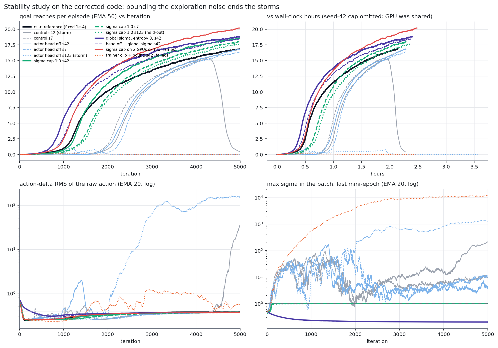

# WujiHand action-rate storm: findings and status (2026-09-18, 10:00 PDT)

Companion to `WUJI_STABILITY.md` (the outside review) and the shareable page
(`https://claude.ai/code/artifact/4413e4cc-fc2b-40db-a112-929ffa3bc65d`, same content, private).
All numbers below are computed from the TensorBoard logs by `scratchpad/wuji/stats_all.py`
and `plot_all.py`; the study runs use branch `VM/fix/wuji-stability` (6e8d1fc).

## Status: the study is complete, and bounding the exploration noise ends the storms

Nineteen runs on the corrected code (branch `VM/fix/wuji-stability`, 06aa3ce), 8192 envs x 40
steps x 5,000 iterations, raw actions and rewards unchanged unless stated. Reaches at 5,000
(EMA 50); "clean" means no action storm, action-delta RMS 0.36-0.37 (reference 0.39) and no
explosive update.

| arm (all: bignet, adaptive band 5e-5..2e-4 unless stated) | seed 42 | seed 7 | seed 123 (held-out) |
|---|---|---|---|
| control | storm at 4,421 | 16.9 clean | |
| actor value head off | 16.8 clean | 16.4 clean | never took off (storm 2,025) |
| **sigma cap 1.0** (`max_sigma`) | **18.6 clean** | **18.0 clean** | **17.6 clean** |
| head off + sigma cap | 18.4 clean | 17.4 clean | |
| **global sigma** (`fixed_sigma: true`, entropy 0) | **18.8 clean**, takeoff 960, 1.56 h to 16.9 | running | running |
| head off + global sigma | 18.4 clean | | |
| hard clip | 16.6 clean | collapsed after 12.9 (sigma tail, no action storm) | |
| rollout KL reference | 15.3, takeoff only at 3,118 | never took off (storm 2,364) | |
| trainer-side clip + bound 0.005 | never took off, max sigma 1e4 | | |
| sigma cap on 2 GPUs (2x frames) | | **20.2 clean**, 1.50 h to 16.9 | |

Reference: 16.9 at 5,000, 2.14 h. Seed-42 cap wall-clock is invalid (GPU shared with another
project's job for three hours); iteration results stand.

What the table says:

1. **Every arm that keeps a state-dependent sigma without a ceiling fails on at least one seed**
   (control, head off, hard clip, rollout KL). **Every run with a bounded or global sigma is
   clean** (eight of eight so far), and they are also the best scores and the earliest takeoffs
   of the campaign. The sigma cap passes the predeclared rule: two seeds plus the held-out seed,
   all above the reference with its smoothness.
2. **The mechanism, now with a decisive negative.** Trainer-side clipping (IsaacGym's
   arrangement, with DeXtreme's bound loss) made things catastrophically worse: with clipped
   actions the task's penalty no longer sees raw noise, and the per-state sigma head, freed of
   the only force holding it down, ran to 1e4. DeXtreme survived the same clipping with a
   global sigma. So the raw-action penalty was restraining the sigma head all along, and the
   storms are what happens on the states where it fails to. The `WUJI_VS_SHADOW_ALLEGRO.md`
   interaction hypothesis (state-dependent sigma x shared-trunk updates x action boundary)
   is the explanation that fits all nineteen runs and the historical Shadow/DeXtreme results.
3. **Global sigma** (the Shadow/DeXtreme setting, entropy 0 because a positive bonus on a
   global sigma ran away in July) gives the best single-GPU result on the storming seed,
   18.8, the earliest takeoff (960) and the fastest time to the reference level (1.56 h vs
   2.14 h). Its sigma sits on the 0.2 floor and its mean tail is the smallest of any run.
   Seeds 7 and 123 are running; if they hold, it is the simplest official recipe, needing no
   new code at all.
4. The auxiliary actor value head is a contributing path (head off helps the tail and helped
   two seeds), not the cause: with the head on and sigma bounded, every run is clean.
5. The signed diagnostics show the surrogate pushing sigma **down** on negative-advantage
   samples even while sigma explodes, so the widening is not the policy gradient's doing; with
   the head off it still happens (seed 123), so trunk drift from any source suffices once the
   head is per-state. The corrected post-step KL reads 0.003 per minibatch step and 0.01
   against the reference per iteration on clean runs, consistent with the 0.01 target.

Running now (09:36): global sigma on seeds 7 and 123; then global sigma and sigma cap each
with a fixed 1e-4 rate on seed 42 (does adaptivity still matter once sigma is bounded); then
global sigma on 2 GPUs. Done by about 17:00.

## Results, pre-fix code

| run | recipe | reaches at end (EMA 50) | peak @ iter | takeoff (≥5) | hours | h to 16.9 | end action-delta RMS | end raw action-rate /s | status |
|---|---|---|---|---|---|---|---|---|---|
| July v16 | 512 actor, band 1e-4..2e-4, July code, RTX 4090 | 17.15 | 17.17 @ 4,987 | 1,797 | 4.07 | 3.91 | 0.375 | 11 | reference only |
| Arbiter | Wuji rsl-rl fork, fixed 1e-4 | 16.89 | 16.91 @ 4,998 | 1,336 | 2.14 | 2.14 | 0.388 | 9 | clean |
| A | bignet, band 1e-4..2e-4, seed 42 | 3.61 | 16.69 @ 3,685 | 1,429 | 1.89 | — | 22.791 | 98,870 | terminal storm 3,749; killed 4,264 |
| B | bignet, band 1e-4..2e-4, seed 7 | 0.00 | 0.29 @ 1,046 | never | 2.25 | — | 659.325 | 66,135,912 | terminal storm 1,044 (pre-takeoff) |
| C | A + reward floor −5 | 16.98 | 17.22 @ 4,778 | 758 | 2.26 | 1.84 | 5.075 | 198,695 | storm 2,967 under the floor; disqualified |
| D | C on 2 GPUs (2x frames/iter) | 19.51 | 19.57 @ 4,811 | 538 | 2.39 | 0.96 | 15.992 | 1,142,660 | storm 1,918 under the floor; throughput point only |
| E | bignet, band 5e-5..2e-4, seed 42 | 12.93 | 16.54 @ 4,701 | 2,137 | 2.21 | — | 0.609 | 184 | terminal storm 4,909 |
| F | bignet, band 5e-5..2e-4, seed 7 | 17.56 | 17.57 @ 4,820 | 1,807 | 2.22 | 1.93 | 0.358 | 9 | clean |
| G | bignet, fixed 1e-4, seed 42 | 17.69 | 17.69 @ 5,000 | 1,794 | 2.26 | 1.98 | 0.370 | 9 | clean |
| H | E + value normalisation off | 0.00 | 0.01 @ 100 | never | 2.57 | — | 149980.016 | 1,544,143,765,504 | destroyed by 105 (aux value head, raw MSE) |
| I | F's recipe on 2 GPUs, seed 7 | 14.95 | 17.18 @ 4,147 | 1,946 | 2.32 | 1.84 | 0.341 | 16 | peak 17.2 then faded to 15.0, no storm |

Reference smoothness: action-delta RMS 0.39, raw action-rate 9 per second. "h to 16.9" is
wall-clock until the EMA first reaches the arbiter's final value. D and I process twice the
frames per iteration at 1.7 s per iteration, so 2 GPUs mean data per iteration, not seconds
per iteration (390k vs 205k frames/s).

## Results, corrected code (study)

| arm | seed | reaches at 5,000 | end action-delta RMS | KL>1 events | max sigma at 5,000 (last mini-epoch) | storms (action-delta EMA20 > 0.45) |
|---|---|---|---|---|---|---|
| control | 42 | 0.41 (peak 15.5 @ 4,270) | 35.6 | 0 | 216 | 1,029–1,038, 1,436–1,523, **4,421–5,000** |
| control | 7 | 16.9 | 0.363 | 2 | 11.5 | 352–355 |
| no_actor_value | 42 | 16.8 | 0.366 | 0 | 2.5 | 1,007–1,022, 1,101–1,509 (recovered) |
| no_actor_value | 7 | 16.4 | 0.366 | 1 | 8.8 | 1,612–1,626 (recovered) |

## What the storm is (diagnostics on the corrected code)

The new opt-in diagnostics log, per mini-epoch, the batch maximum of sigma, of |mu| and of the
rollout log-ratio. The batch **mean** sigma sits on the 0.2 floor in every run. The batch
**maximum** does not:

| control seed 42, iteration | mean sigma | max sigma | max abs mean action | max abs log-ratio | action-delta RMS |
|---|---|---|---|---|---|
| 4,300 | 0.210 | 36 | 3.1 | 230 | 0.380 |
| 4,400 | 0.220 | 58 | 4.4 | 20 | 0.405 |
| 4,420 (storm tips) | 0.240 | 69 | 4.8 | 753 | 0.460 |
| 4,500 | 0.237 | 60 | 6.1 | 258 | 0.424 |

The policy std is state-dependent (`softplus(raw) + 0.2`, no ceiling). On a small set of
states it emits sigma of 40–200 and means of 3–7 (the actuator clamps at ±1), and that tail
grows for hundreds of iterations before the storm tips. The clean seed-7 control has the
same tail growing more slowly (max sigma 0.5 at 2,000, 14 at 4,900); with `no_actor_value`
it is smaller at 5,000 (2.5 and 8.8) on the two seeds run so far. These are measurements.
What follows is the leading hypothesis, not yet established: those states produce
out-of-range actions, likelihood ratios of e^100 and per-sample KL of order 100, and feed
back through the three frames of raw-action history in the observations and the unbounded
action-rate term (weight −1, first plus second squared differences of the raw action).
Batch means hide the tail either way. Whether the tail causes the storm or accompanies it
needs the matched-sample diagnostics now logged (signed sigma score by advantage sign, tail
fraction, post-step KL on the same minibatch) and a saved-batch replay around an onset.

Consequences for the adaptive learning rate:

1. Its signal is the batch-mean KL, which a few tail samples with KL ~100 either dominate or,
   with the previous-mini-epoch reference (`dataset.update_mu_sigma` after each minibatch),
   hide. Neither reading identifies the tail.
2. Its only actuator is one global learning rate inside a 2–4x band. A rate cut slows the whole
   policy equally and does nothing to the tail states, which drift at 5e-5 as at 2e-4.
3. A linear schedule (2e-4 → 5e-5) has the same blind spot with no feedback; it would sit at
   its highest rate during the pre-takeoff explosive updates and at its lowest late.

These three points hold whatever the tail's causal role is: they follow from what the
controller reads and what it can move.

Gradient attribution, a **checkpoint-restart experiment** (`scratchpad/wuji/grad_attrib.py`):
the model, optimizer and normaliser states are restored from a checkpoint, a fresh
environment is built and one rollout and one PPO iteration are run. The environment's
curriculum and disturbance state are not in the checkpoint, so the rollout is not the batch
that produced the original trajectory, and for the onset checkpoint it is not the onset
batch. It measures how the loss terms compete on that policy under a restarted environment,
nothing more. Per-minibatch gradient norms into the shared actor trunk:

| checkpoint | surrogate grad norm (median / p90) | value-head grad norm (median / max) | value / surrogate (median / max) | cos | max ratio per iteration (median) |
|---|---|---|---|---|---|
| A @ 3,500 (pre-storm) | 0.51 / 1.04 | 0.025 / 0.94 | 0.05 / 1.25 | −0.01 | 12.6 |
| A @ 3,725 (onset) | 0.22 / 1.01 | 0.028 / 0.70 | 0.14 / 5.8 | 0.00 | 41.4 |
| F @ 4,700 (clean) | 0.81 / 1.74 | 0.029 / 0.13 | 0.03 / 0.06 | −0.01 | 4.4 |

The auxiliary value head's gradient is 3–14% of the surrogate's per minibatch and orthogonal
to it, with spikes to 6x at the onset checkpoint. Its per-step share is small. Over 5,000
iterations the arm without it finished clean on both seeds with a smaller sigma tail at
5,000; whether the head causes the tail, or the two seeds got lucky, is what the held-out
seed and the matched-sample diagnostics are for. Run H (value normalisation off)
is the extreme case: the head's raw MSE of order 1e25 destroyed the policy within 105
iterations. Normalised advantages have heavy tails too (max 60–120 after normalisation), so a
handful of catastrophic samples dictate the surrogate direction on the iterations that matter.

Corrections to the first draft of this analysis, from the review: the log-sigma score is
proportional to A·(z²−1), so negative advantages widen sigma only for near-mean samples; the
difference penalty alone pushes variance down; `Episode_Reward/*` divides by the 50 s
maximum episode duration, not the actual one; and the task carries a disturbance ramp
from iteration ~250 to ~4,000, so it is not stationary at run A's onset.

## Fixes on `VM/fix/wuji-stability`

- From the review (b517fb7): exact diagonal-Gaussian KL (the epsilon reported −0.0023 for
  identical policies at sigma 0.2), fp32 policy math under autocast, old values and returns
  normalised with the same running statistics, `kl_reference: rollout` option (default
  unchanged), opt-in policy diagnostics.
- New (6e8d1fc, corrected in 6d59960): `max_sigma`, a smooth ceiling after any sigma
  parametrization, now a rational squash `x/(1+x)` whose gradient decays polynomially (the
  first version used tanh, which saturates to exactly 1.0 in fp32 a few units above the cap
  and then has zero gradient). What it bounds: the exploration noise and the sigma-driven
  part of the likelihood ratio and per-sample KL. What it does not bound: the mean, and
  therefore sampled actions, ratios and KL through the mean term. Whether a ceiling changes
  the outcome is an empirical question, not a stability guarantee. The `sigma_cap` pair
  running now uses the tanh version; `no_actor_value + max_sigma` is queued on the corrected
  one.
- New (6d59960): opt-in diagnostics for the review's "signed, matched-sample" request: per
  mini-epoch the log-sigma score A·(z²−1) split by advantage sign, the fraction of samples
  with max |z| > 3, and KLs from one extra forward of the same minibatch after the optimizer
  step (pre→post on those samples; post vs the scheduler's reference, mean and max).
- Candidate, not yet run: the mean-action counterpart (`bound_loss_type: bound` with a real
  coefficient) so |mu| stays near the clamp range where the task gradient exists.

## Decision rule and open questions

An arm counts when both seeds survive 5,000 iterations with action-delta RMS near 0.39 and
reaches at or above the reference, then the held-out seed 123 confirms it, then the 2-GPU
run gives the wall-clock number. The predeclared bar for a "large win" is 20% more held-out
reaches at equal frames on three seeds with no smoothness or drop-rate loss.

Open: (1) what starts the tail; the disturbance ramp, the raw-action history feedback and
the aux head are the candidates, and a saved-batch replay around a known onset (B at 1,038)
is the proposed diagnostic; (2) why the reference shows no tail at all with the same std
floor: separate networks, fixed 1e-4, raw values and 32 minibatches are the remaining diffs;
(3) whether the controller should read a robust KL statistic (median or trimmed mean) once
sigma is bounded, and whether rl_games should default `use_experimental_cv` to false when a
central critic is configured.
